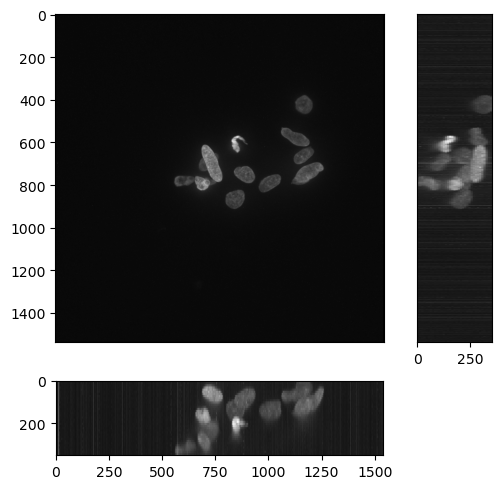
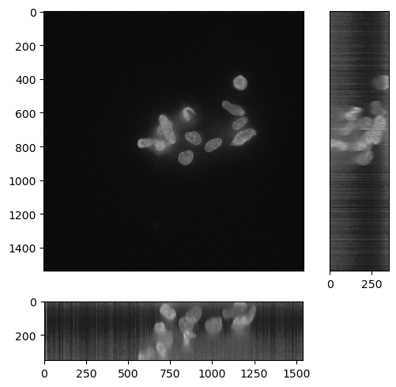
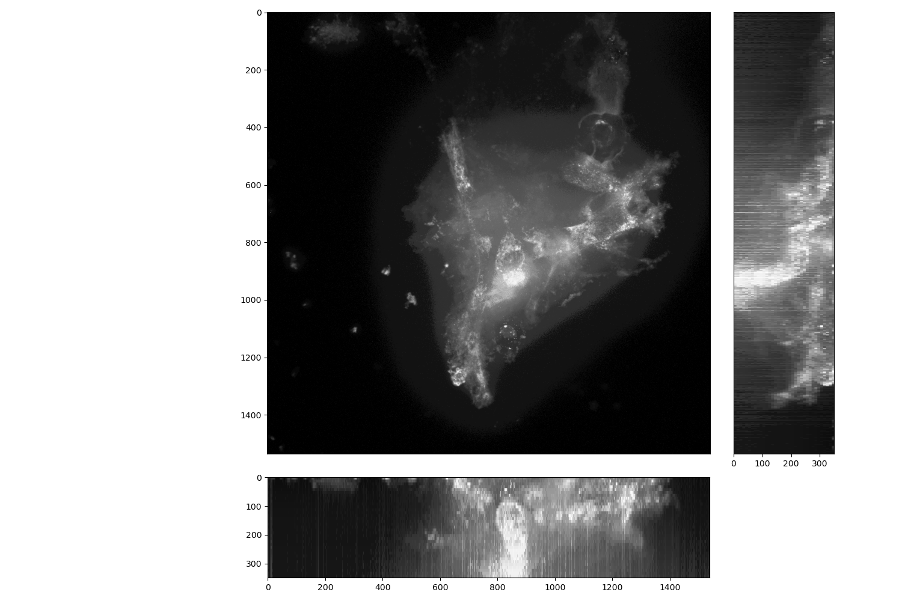
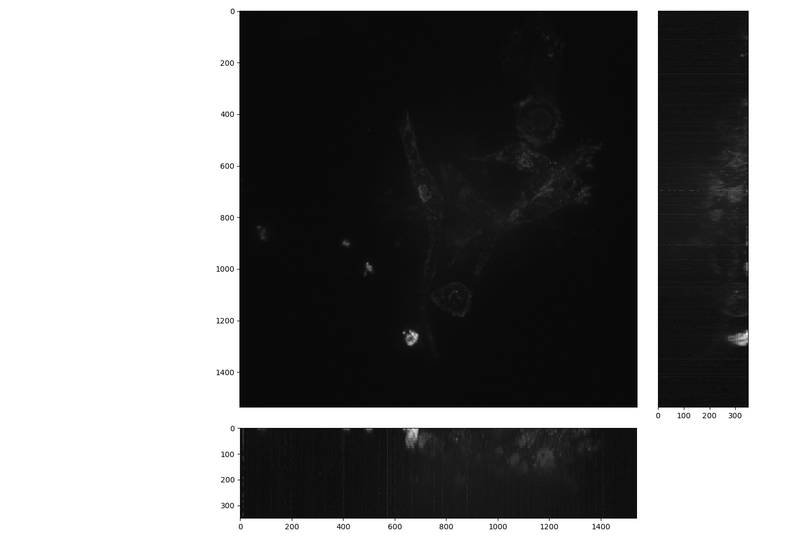
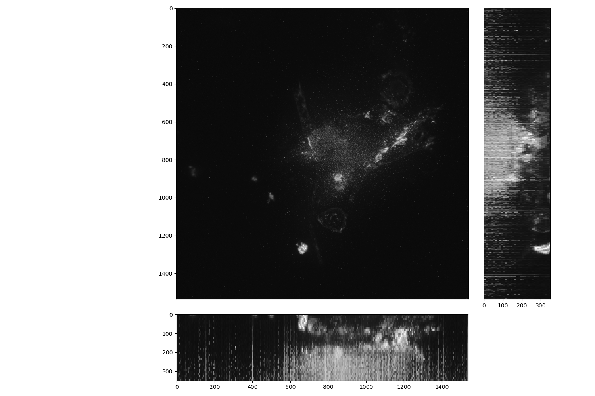
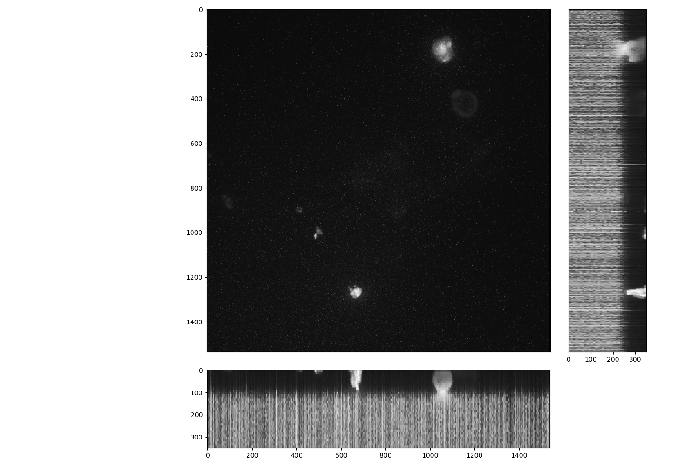
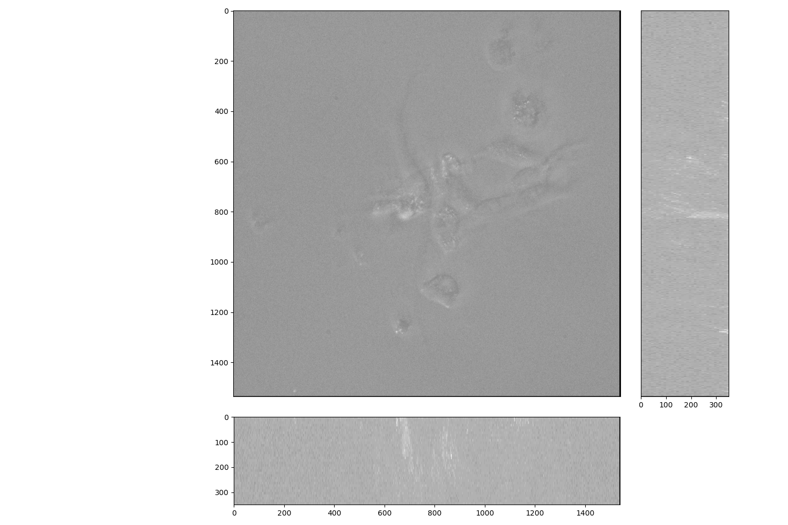
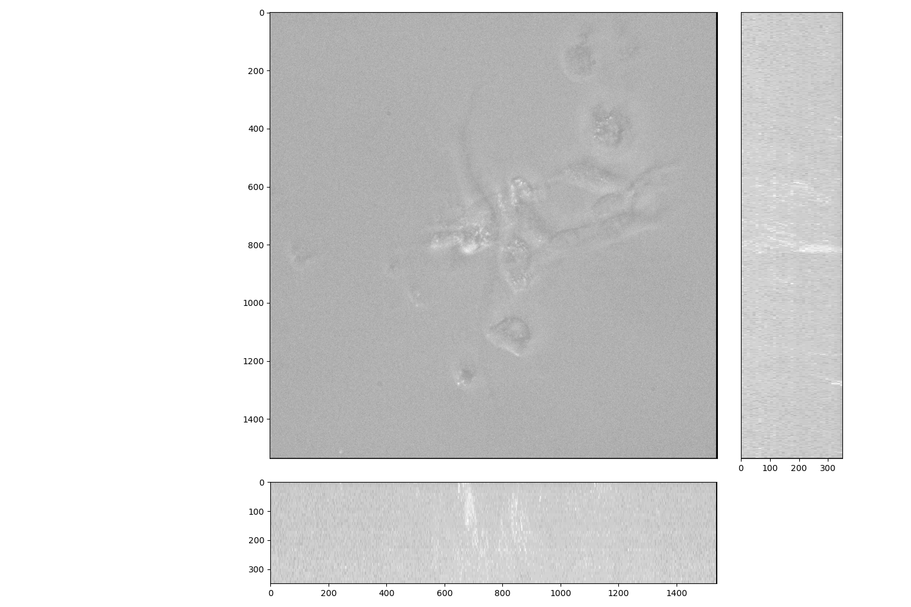

# Z slice intensity normalization
## Nuclei
| Raw image | Z slice intensity normalized |
| :---: | :---: |
|  |  |

## Endoplasmic reticulum
| Raw image | Z slice intensity normalized |
| :---: | :---: |
|  |  |

## Actin, Golgi, and Plasma membrane
| Raw image | Z slice intensity normalized |
| :---: | :---: |
|  |  |

## Mitochondria
| Raw image | Z slice intensity normalized |
| :---: | :---: |
|  |  |

## Brightfield
| Raw image | Z slice intensity normalized |
| :---: | :---: |
|  |  |
