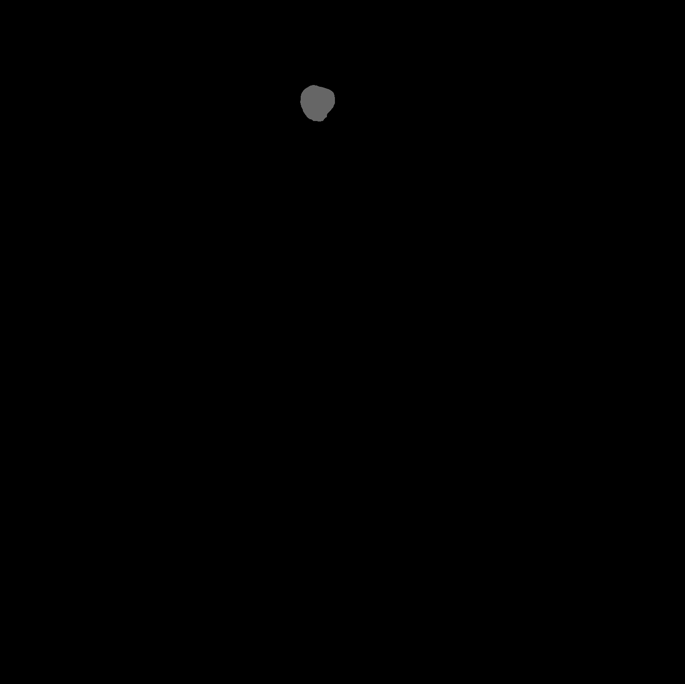
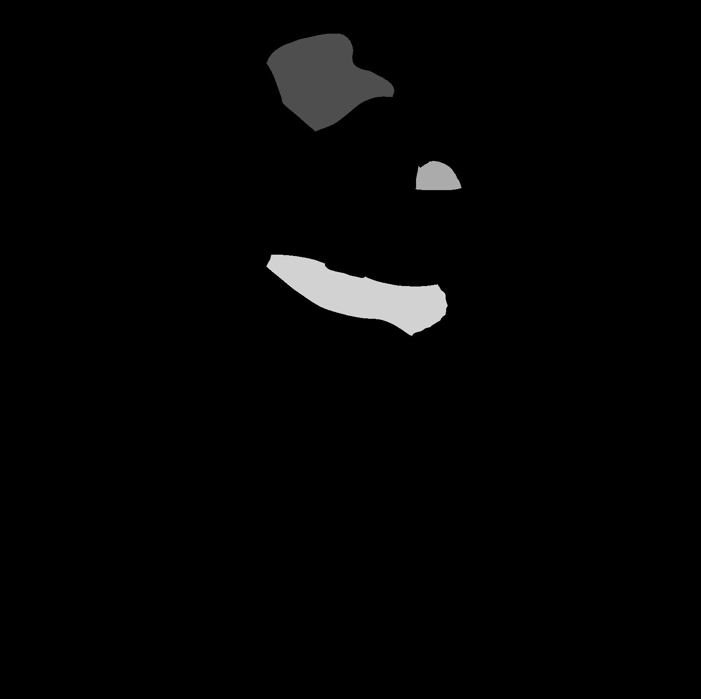
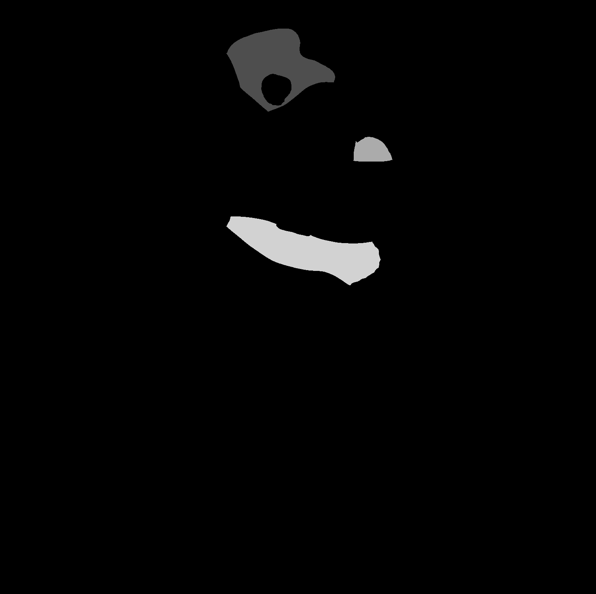

This module segements the organoid, nuclei, cells, and cytoplasm from the images.

# GIF Grid of Segmentation Output
### Raw channels
| 405 | 488 | 555 | 640 | TRANS |
|:-:|:-:|:-:|:-:|:-:|
|  |  |  |  |  |

### Organoid, Nuclei, Cell, and Cytoplasm Segmentations
| Organoid | Nuclei | Cell | Cytoplasm |
|:-:|:-:|:-:|:-:|
|  |  |  |  |

For segmentation, we have found 3D too computationally expensive, yields less than optimal results, and/or did not work at all [errors in the code].
We have employed a 2.5D segmentation methodology in combination with Cellpose 2D segmentation.
For nuclei and cells, we take a sliding window of n z-slices, where we perform max-projection on these slides and perform segmentation on these slices; where n is the sliding window size.
We then decouple the max-projection to collect a segmentation mask per z-slice.
We then output the masks across all z-slices per image set as a stacked-TIFF file.

Well F4-2 for the NF0014 group throws an error in cellpose - I will exclude these images from the segmentation process.
