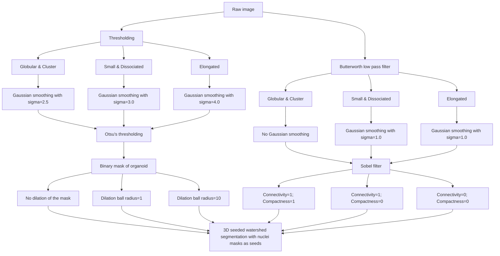

# Segmentation of 3D organoid images
To extract features in the next module, we need to segment the images to tell the machine where in the image the objects are.
We segment the following objects:
- Nuclei
    - This is the nucleus of the cell.
- Cell
    - This is the whole cell, including the nucleus and cytoplasm.
- Cytoplasm
    - This is the part of the cell that excludes the nucleus.
- Organoid
    - This is the whole organoid, including all cells and the surrounding matrix.

We take an interesting approach to segmentation.
This is due to the data we are working with.
The data are NF1 patient-derived 3D organoids with a pilot drug screen applied to them.
The data are heterogeneous, meaning that the organoids vary in size, shape, and stain intensity.
This is due to the difference in patient samples, the difference in drug treatments, and the difference in imaging quality.
This leaves us with a classic Computer Science problem: how do we apply a method that is "one size fits all" to a heterogeneous dataset?
The short answer is that we can't.
The long answer is the methods used which I will describe in more detail below.

## The workflow (what we do, why we do it, and how we do it)
1. Establishing diverging gross morphology segmentation pipelines depending on the whole field of view (FOV) morphology.
    - We featurize the entire FOV using pre-trained ViT models (SAMMed3D and CHAMMI-75).
        - SAMMed3D returns 384 features per channel, per volumetric FOV.
        - CHAMMI-75 returns 75 features per channel, per z-maximum projection of the FOV.
    - We train a logistic regression classifier to classify the FOVs into seven (7) morphological classes based on the features extracted from the FOVs.
        - The seven classes were manually annotated by looking at the FOVs and categorizing them based on their morphology.
        - The seven classes are:
            1. Small
                - Small organoids with few cells clumped together.
            2. Globular
                - Large organoids with many cells clumped together in a globular shape.
            3. Elongated
                - Large organoids with many cells clumped together in an elongated shape.
            4. Dissociated
                - Small/medium organoids with many cells dissociated from each other.
            5. Cluster
                - Single cells in a cluster, but not clumped together in a globular or elongated shape.
            6. Blank
                - No organoids, just background.
            7. Fail
                - Black images, likely an image corruption issue.
    - We annoted 3013 FOVs out of 4156 (72.5%) present in the dataset set.
        | Class | Count |
        | --- | --- |
        | Small | 828 |
        | Globular | 276 |
        | Elongated | 234 |
        | Dissociated | 1078 |
        | Cluster | 587 |
        | Blank | 6 |
        | Fail | 4 |
        - After removing the "blank" and "fail" classes, we are left with 3003 annotated FOVs.
    - We train a logistic regression classifier to classify the FOVs into the seven classes based on the features extracted from the FOVs.
    - We used the following training/testing split:
        - Train: 80% (1960 FOVs)
        - Validation: 10% (245 FOVs)
        - Test: 10% (245 FOVs)
        - Holdout: 22.57% (553 FOVs) (not included in the training/testing split, used for final evaluation of the model)
    - We use the trained classifier to predict the class of each FOV in the dataset, including the 1143 FOVs that were not annotated.
2. Segmenting the nuclei, cell, cytoplasm, and organoid in each FOV using the appropriate pipeline.
    - Regardless of the predicted class, we segment the nuclei using CellposeSAM, a pre-trained deep learning model for cell segmentation.
    - We then use the nuclei masks to perfomrm 3D seeded watershed segmentation.
        - We change the parameters and preprocessing of the images depending on the predicted class of the FOV.
        - All labels have the raw signal run throguh a butterworth low pass filter to smooth the image and make the watershed segmentation more robust.
        - Then the the image is thresholded using a global thresholding method (Otsu's method) to create a binary mask of the organoid as a way to limit the watershed segmentation to the organoid and not segment the background.
        - This thresholding is perfomed on a gaussian smoothed version of the raw signal to make the thresholding more robust - this is parameterized based on the predicted class of the FOV.
        - Depending on the predicted class of the FOV, we dialate the thresholded mask to make sure we are capturing the whole organoid and not just the core of the organoid.
        - We then apply a gaussian filter and a sobel filter to the raw signal to smooth it and make the watershed segmentation more robust - this is parameterized based on the predicted class of the FOV.

## Cell segmentation workflow diagram

