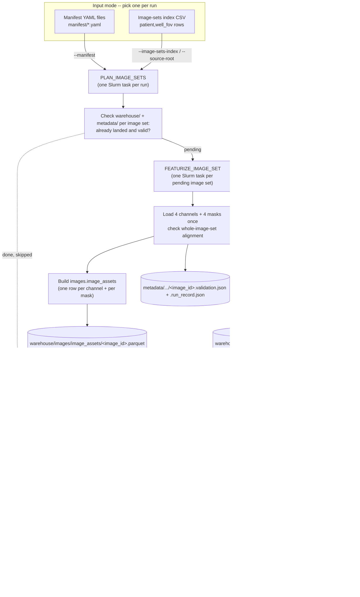
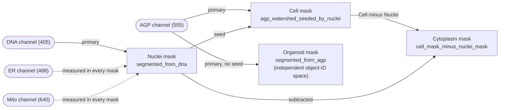

# NF1 ZEDProfiler Production Workflow

Runs ZEDProfiler feature extraction through Nextflow on Alpine at production
scale -- many patients, every well/FOV -- reusing the exact fan-out engine
`3a.nextflow_pilot` validated on 1-2 image sets, pointed at a new, isolated
PetaLibrary location instead of the pilot's.

This folder does not fork the pilot's logic. `scripts/`, `workflows/`, and
the manifest/warehouse shapes are the same code, copied and renamed for a
separate PetaLibrary root and separate `NF1_PROD_*` environment-variable
namespace so a production run can never collide with pilot output. Where
this folder's defaults differ from the pilot's, it's because production
scale changes what a sane default is (see
[Differences from the pilot](#differences-from-the-pilot) below) -- read
`3a.nextflow_pilot/README.md` and `PLAN.md` for the full benchmark history
and channel/compartment role tables behind every default here, and the
[Architecture](#architecture) section below for the DAG and compartment
diagrams reproduced directly in this folder rather than only by reference.

Data staged on PetaLibrary:

```text
/pl/active/koala/nf1-3d-production-workflow-db/data/<patient>/zstack_images/<well_fov>/
/pl/active/koala/nf1-3d-production-workflow-db/data/<patient>/segmentation_masks/<well_fov>/
```

(`~/mnt/alpine/active/koala/nf1-3d-production-workflow-db/...` from a host
where PetaLibrary is mounted locally rather than on Alpine itself -- same
share, different mount point.)

## Architecture

Unchanged from `3a.nextflow_pilot` -- reproduced here rather than only
linked, since a prior PR review (WayScience/NF1_3D_organoid_profiling_pipeline#158)
specifically asked for a picture of the DAG, and a reader of this folder
shouldn't have to open a sibling folder's README to get one.

### Pipeline flow



`PLAN_IMAGE_SETS` skips `FEATURIZE_IMAGE_SET` for any image set whose
warehouse output already exists and validated -- rerunning a
mostly-finished batch doesn't redo the finished part (this exists because
of a PR #158 review question about rerun/preemption risk on
already-computed image sets). Total Slurm jobs for N image sets, P of them
still pending: `P + 3` (P `FEATURIZE_IMAGE_SET` tasks + 1
`PLAN_IMAGE_SETS` task + 1 `BUILD_WAREHOUSE` task + the coordinator job
itself); `P == N` on a fresh run.

**Deliberately decoupled from ZEDProfiler itself.** `build_warehouse_from_
compartments.py`/`build_duckdb_views.py` only ever consume the parquet
files `FEATURIZE_IMAGE_SET` already wrote -- they know nothing about
ZEDProfiler's feature families, loaders, or masks. That split (per
MikeLippincott's PR #158 review: *"This reads like something that should
have a software -- maybe a cytotable port over in the future... I like the
decoupling as it keeps the featurization flexible."*) is intentional:
featurization can change without touching how results get warehoused, and
the warehousing/DB-management layer could plausibly grow into a standalone
package later, in the spirit of [CytoTable](https://github.com/cytomining/CytoTable).
Not planned work here, just a design property worth keeping in mind at
production scale too.

### Compartment segmentation relationships



`Nuclei` segments independently from `DNA` alone. `Cell` is an AGP
watershed *seeded* by `Nuclei`'s own segmentation, so their object IDs
coincide -- which is why `joined.images_nuclei_cell_cytoplasm` can join all
three compartments on `Metadata_Object_ObjectID` directly. `Cytoplasm` is
**not** an independent seeded watershed at all -- it's the plain set
subtraction `Cell mask - Nuclei mask`. `Organoid` segments from `AGP`
independently, with no seed channel and its own, much smaller object-ID
space, so it's never part of the Nuclei/Cell/Cytoplasm join. Confirmed
empirically twice now, not just once: the pilot's own `NF0014_T1/C4-2`
benchmark and this folder's own single-image-set test case
(`prod-testcase-nf0014-c4-2`, see [Status](#status) below) both produced
exactly 45 Nuclei objects but only 42 Cell/Cytoplasm objects -- a strict
subset, one row per object that successfully segmented in every compartment.

## Status

- [x] `nf1-3d-production-workflow-db` created on PetaLibrary (`data/`,
      `results/`, `tools/`), isolated from `nf1-3d-pilot-workflow-db`.
- [x] This folder scaffolded from `3a.nextflow_pilot`, renamed and
      re-tuned for production scale (see below).
- [x] Staging: bandicoot -> PetaLibrary for the 12-patient batch
      (`staging/`) -- **all 12 staged and verified** (3,443/3,449 well/FOVs
      complete; the 6-well shortfall is a source data gap on bandicoot
      itself, not a transfer issue -- see `staging/README.md`).
- [x] A repo checkout, `uv sync`, and Nextflow/JDK toolchain on Alpine under
      `/pl/active/koala/nf1-3d-production-workflow-db/` (same one-time setup
      the pilot's README documents under "Alpine notes from 2026-08-10";
      JDK21 and the Nextflow launcher were copied from the pilot's own
      working install rather than re-downloaded, keeping this folder's
      `tools/` isolated from the pilot's).
- [x] **Single-image-set test case** (`NF0014_T1/C4-2`, run ID
      `prod-testcase-nf0014-c4-2`): confirms the full toolchain works
      end-to-end against real staged production data. `PLAN_IMAGE_SETS`
      34.6s, `FEATURIZE_IMAGE_SET` 19m 10s (peak RSS 5.2 GB),
      `BUILD_WAREHOUSE` 4.9s; `validation_status: pass` on every table, row
      counts matching the pilot's own historical benchmark for this exact
      image set exactly. Output was 1.4 MB for this one image set --
      consistent with the ~5 GB estimate for the full 3,443-image-set batch.
      This is one image set on one Slurm task, so it validates the
      toolchain and gives a real per-task timing/memory data point, but it
      does *not* validate concurrent throughput under `queueSize=180` or
      `BUILD_WAREHOUSE`'s behavior at higher N -- the staged capacity test
      below is still the next step.
- [ ] A staged capacity test at intermediate scale before the full batch
      (see PLAN.md) -- the pilot's own production-scale estimate flags this
      as a prerequisite, not optional polish.
- [ ] First production run.

## Staging

Before any Nextflow run, the target patients' raw data must exist under this
folder's PetaLibrary `data/` root -- it is not read from bandicoot directly.
See [`staging/README.md`](staging/README.md) for the transfer script, the
current 12-patient batch (`staging/patients.txt`), and how to verify
completeness. That batch is roughly ~3,449 well/FOV directories -- large
enough to run as a background/tmux job, not inline.

## Run

From a repo checkout on Alpine, once staging has landed data and the shared
`uv` environment exists (see `environments/zedprofiler-uv.md`):

```bash
cd /pl/active/koala/nf1-3d-production-workflow-db/NF1_3D_organoid_profiling_pipeline/3b.nextflow_production
make check
UV_CACHE_DIR=/pl/active/koala/nf1-3d-production-workflow-db/tools/uv-cache \
  uv sync --project environments
make build-image-sets-index SOURCE_ROOT=/pl/active/koala/nf1-3d-production-workflow-db
make submit-dry-run RUN_ID=nf1-production-batch-1 ACCOUNT=amc-general
# Run the staged capacity test from PLAN.md first -- see "Before the first
# full run" below. Only run this against the full index after that passes:
make submit RUN_ID=nf1-production-batch-1 ACCOUNT=amc-general
```

`make submit` defaults to the index-driven path
(`IMAGE_SETS_INDEX=manifest/image_sets_index.csv`), not a single manifest --
see [Differences from the pilot](#differences-from-the-pilot). For a single
ad-hoc image set instead (troubleshooting, not a production run):

```bash
make run IMAGE_SETS_INDEX= MANIFEST=manifest/generated_manifest.yaml \
  PATIENT=NF0014_T1 WELL_FOV=C4-2
```

Every other Make target, flag, and environment variable works exactly as
documented in `3a.nextflow_pilot/README.md`'s "Run" section, with `NF1_PROD_*`
in place of `NF1_PILOT_*` (e.g. `NF1_PROD_ACCOUNT`, `NF1_PROD_RESULTS_ROOT`).
`make help` prints the full list from this folder's own `bin/nf1-nextflow-production`.

## Differences from the pilot

- **PetaLibrary root**: `nf1-3d-production-workflow-db`, not
  `nf1-3d-pilot-workflow-db`. Entirely separate `data/`, `results/`, and
  `tools/` trees; nothing here reads or writes under the pilot folder.
- **Environment variable prefix**: `NF1_PROD_*`, not `NF1_PILOT_*`.
- **Default run mode is index-driven.** `IMAGE_SETS_INDEX` defaults to
  `manifest/image_sets_index.csv` (build it first with
  `make build-image-sets-index`), not a single checked-in manifest file --
  production runs are many patients and many well/FOVs, not one image set.
  `manifest/smoke_test_image_set.yaml` is kept only as a worked example /
  fallback for `--manifest`-driven ad-hoc runs; regenerate it for a real
  patient with `make build-manifest PATIENT=... WELL_FOV=...` rather than
  hand-editing it, and prefer the index path for anything beyond a single
  troubleshooting run.
- **`conf/curc_alpine.config` raises `executor.queueSize` from the pilot's
  `20` to `180`**, and drops `submitRateLimit` entirely. The pilot's own
  `PLAN.md` ("Production-scale (4200 image-set) time estimate") identified
  `queueSize=20`/`submitRateLimit='20/min'` as the dominant throughput
  bottleneck at scale, not compute efficiency or Alpine's real limits, and
  recorded that CURC already confirmed `queueSize=200` with no rate limit is
  fine for a many-short-task workload like this one. `180` leaves headroom
  under the `amc-general` account's `MaxJobs=200` hard ceiling, which is
  shared across every QOS the account uses. Re-check current
  `MaxJobs`/`sinfo` contention before a full run -- this is a starting
  point carried over from that analysis, not independently re-validated
  against live cluster state.
- **`schema_version` is `0.1.0-production`**, not `0.1.0-pilot`, in
  manifests this folder generates.

Everything else -- the Nextflow DAG shown in [Architecture](#architecture)
above, the warehouse directory shape, the alignment contract, the
channel/compartment role tables, the skip-already-completed-image-sets
behavior, and the shared-`uv`-environment worker pattern -- is unchanged
from `3a.nextflow_pilot`. See that folder's README for the full benchmark
history and the channel/compartment role tables this summary doesn't
repeat.

## Before the first full run

Carried over directly from the pilot's own production-scale analysis
(`3a.nextflow_pilot/PLAN.md`, "Production-scale (4200 image-set) time
estimate" and its "Fair-share priority impact" subsection) -- re-read that
section before scheduling a full run, not just this summary:

- **`BUILD_WAREHOUSE`'s scaling with image-set count is unmeasured past
  N=2.** It's a deliberate single-writer step, so it runs fully serially
  after every worker task finishes. Do a staged capacity test at an
  intermediate scale (the pilot suggested 50-100 image sets; this batch's
  full ~3,449 well/FOVs is itself a reasonable "intermediate scale" relative
  to the 4200-image-set full-dataset projection) before trusting any
  wall-time estimate for the complete batch.
- **A run this size will measurably move this account's fair-share
  standing** on Alpine (the pilot's own 2-image-set run already used ~5
  cpu-hours; this batch is roughly 60x that image-set count). The impact
  decays with a 14-day half-life and there is no hard job-count or
  usage-time cap that blocks submission -- see the pilot's PLAN.md for the
  full numbers -- but it is a real, visible effect on other queued jobs
  under this account for several weeks, not a rounding error.
- **Re-query live Alpine state** (`sacctmgr`, `sinfo`, `sshare -u $USER -A
  amc-general -l`) immediately before submitting, rather than trusting any
  cached numbers from pilot-era prep work.
