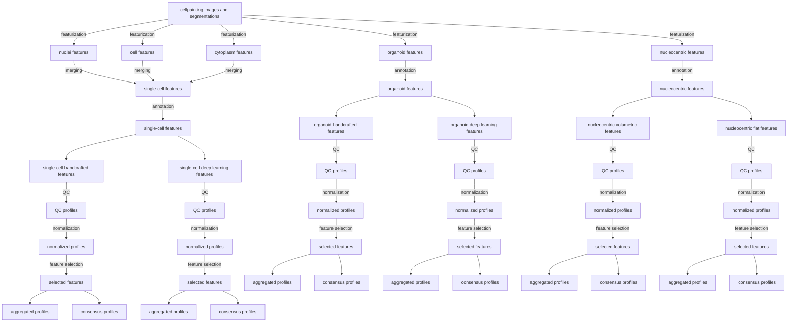

# Featurization merging

The approach to the featurization is to run each feature extraction function for each cell compartment for each channel in a distributed manner.
The results are then combined into a single dataframe for each cell compartment and channel.
The final distinct features are saved as parquet files.
These parquet files are then merged by cell compartment into:

- Nuclei
- Cell
- Cytoplasm
- Organoid

These are stored as related tables in a sqlite database.
The database is then used to merge into a single-cell feature table using cytotable.
For a visual and simplified representation of the pipeline, see the figure below.


## Feature selection blocklist

Features that contain coordinates are removed during feature selection.
These features would be leaked data if used in a machine learning model.

## File and information flow diagram



## Number of feature files per image-set (well_fov)

| Feature type     | # of compartments | # of channels | Total number of feature files |
| ---------------- | ----------------- | ------------- | ----------------------------- |
| AreaSizeShape    | 4                 | 1             | 4                             |
| Colocalization   | 4                 | 6             | 24                            |
| Intensity        | 4                 | 4             | 16                            |
| Granularity      | 4                 | 4             | 16                            |
| Neighbors        | 1                 | 1             | 1                             |
| Texture          | 4                 | 4             | 16                            |
| Deep learning    | 4                 | 4             | 16                            |
| Nucleocentric 3D | 1                 | 4             | 4                             |
| Nucleocentric 2D | 1                 | 4             | 4                             |
| Total            |                   |               | 101                           |

## Reading/writing data on bandicoot

Steps 5 through 12 all call `bandicoot_check()`, which uses
`~/mnt/bandicoot/NF1_organoid_data` as `profile_base_dir` whenever that
mount is present, falling back to this repo's own `data/` only when it
isn't. **Bandicoot/Isilon is the team's go-to primary data source** --
running these scripts with bandicoot mounted reads and writes there
directly, not just as an archival copy.

Each script's own `data/{patient}/{subparent_name}/{stage}/{file}` path
shape doesn't change based on where `profile_base_dir` points -- only the
`{subparent_name}` segment (passed via `--image_based_profiles_subparent_name`,
or `--output_subdir` for step 11's cross-patient output) identifies which
pipeline run's data you're reading. Because more than one run can produce
files with the same names, **each production run uses its own
version-stamped subparent name** (`<subparent-name>_v<date>_<short-git-hash>`)
instead of overwriting a shared unversioned name -- see
`scripts/sync_pipeline_output_to_bandicoot.sh` for how a local run's
output gets synced to bandicoot under that versioned name.

The current production run (ZEDProfiler, all 13 patients, PR #172) lives
on bandicoot as:

```
--image_based_profiles_subparent_name image_based_profiles_production_zedprofiler_v20260915_f5a6f16   # steps 5-10, 12
--output_subdir all_patient_profiles_zedprofiler_v20260915_f5a6f16                                      # step 11
```

Do not hardcode a version string directly into a notebook's own path
construction -- pass it via these existing CLI/interactive arguments
instead, so the same notebook keeps working as new versions land.
