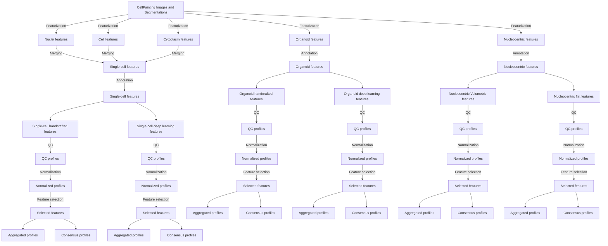

# Featurization merging

The approach to the featurization is to run each feature extraction function for each cell compartment for each channel in a distributed manner.
The results are then combined into a single dataframe for each cell compartment and channel.
The final distinct features are saved as parquet files.
These parquet files are then merged by cell compartment into:
- Nuclei
- Cell
- Cytoplasm
- Organoid

These are stored as related tables in a sqlite database.
The database is then used to merge into a single-cell feature table using CytoTable.
For a visual and simplified representation of the pipeline, see the figure below.

## Feature selection blocklist
Features that contain coordinates are removed during feature selection.
These features would be leaked data if used in a machine learning model.

## File and information flow diagram

