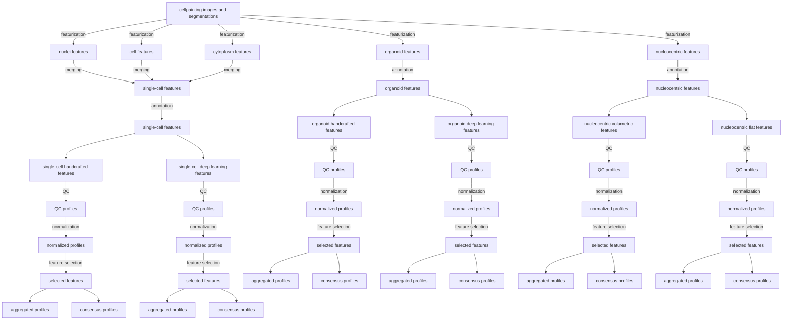
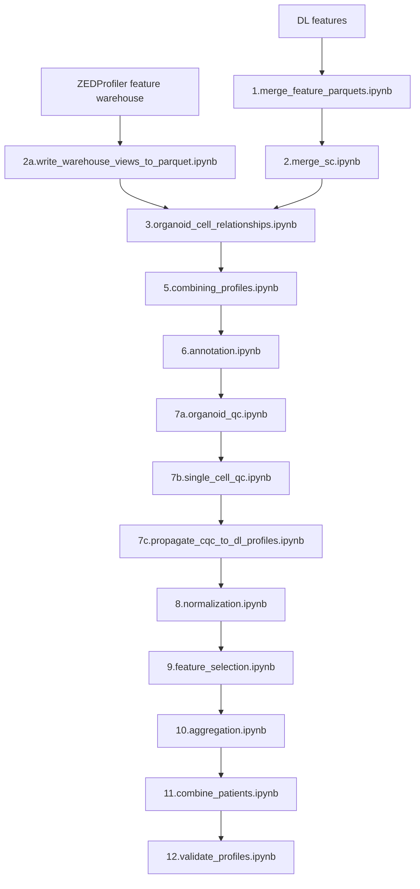

# Featurization merging

The approach to the featurization is to run each feature extraction function for each cell compartment for each channel in a distributed manner.
The results are then combined into a single dataframe for each cell compartment and channel.
The final distinct features are saved as parquet files.
These parquet files are then merged by cell compartment into:

- Nuclei
- Cell
- Cytoplasm
- Organoid

These are stored as related tables in a sqlite database.
The database is then used to merge into a single-cell feature table using cytotable.
For a visual and simplified representation of the pipeline, see the figure below.


## Feature selection blocklist

Features that contain coordinates are removed during feature selection.
These features would be leaked data if used in a machine learning model.

## File and information flow diagram



## Number of feature files per image-set (well_fov)

| Feature type     | # of compartments | # of channels | Total number of feature files |
| ---------------- | ----------------- | ------------- | ----------------------------- |
| AreaSizeShape    | 4                 | 1             | 4                             |
| Colocalization   | 4                 | 6             | 24                            |
| Intensity        | 4                 | 4             | 16                            |
| Granularity      | 4                 | 4             | 16                            |
| Neighbors        | 1                 | 1             | 1                             |
| Texture          | 4                 | 4             | 16                            |
| Deep learning    | 4                 | 4             | 16                            |
| Nucleocentric 3D | 1                 | 4             | 4                             |
| Nucleocentric 2D | 1                 | 4             | 4                             |
| Total            |                   |               | 101                           |

## New flow of data given ZEDProfiler nextflow runs



## Data structure

The input data are located at:

`~/mnt/bandicoot/NF1_organoid_data/data`

The directory is organized by processing stage and profile type showing one patient as an example.

```text
├── NF0014_T1
│   ├── extracted_features
│   ├── image_based_profiles
│   │   ├── 0.converted_profiles
│   │   ├── 1.related_profiles
│   │   ├── 2.combined_profiles
│   │   ├── 3.annotated_profiles
│   │   ├── 4.qc_profiles
│   │   ├── 5.normalized_profiles
│   │   ├── 6.feature_selected_profiles
│   │   ├── 7.aggregated_profiles
│   │   └── 8.consensus_profiles
│   ├── zstack_images
│   └── segmentation_masks
├── NF0014_T2
├── NF0016_T1
├── NF0018_T6
├── NF0021_T1
├── NF0030_T1
├── NF0035_T1
├── NF0037_T1
├── NF0037_T1_CQ1
├── NF0040_T1
├── NF0055_T1
├── SARCO219_T2
└── SARCO361_T1
```

notebookes 1-2 write files to the dir:

```
├── image_based_profiles
│   ├── 0.converted_profiles
```

Notebook `3.organoid_cell_relationships.ipynb` reads from the above dir:
and continues through the ibp pipeline.
