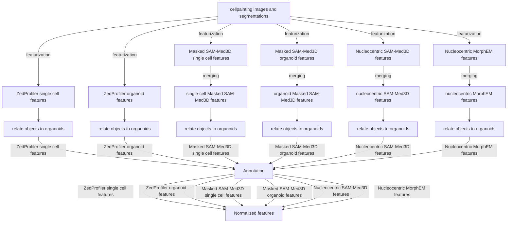

# IBP pilot: stage 4 (organoid-cell relationships) on a ZedProfiler warehouse

## What this is

A pilot checking whether `4.processing_image_based_profiles`'s downstream
steps -- specifically step 3, `3.organoid_cell_relationship.py` (organoid-cell
assignment + spatial shell/distance features) -- can run directly against a
ZedProfiler warehouse (`3a.nextflow_pilot` / `3b.nextflow_production`
output), instead of the older CellProfiler-style per-feature-file pipeline
stage 4 was originally built for.

Two reference image sets, matching the ones used throughout
`3a.nextflow_pilot`: `NF0055_T1/B10-1` and `NF0014_T1/C4-2`
(`manifest/reference_image_sets.yaml`).

## Why steps 00/0a/1/2 are skipped

Those steps convert old per-feature parquet files (101 per image set) into a
merged per-well*fov DuckDB, then merge that into
`sc_profiles*{well*fov}.parquet`/`organoid_profiles*{well*fov}.parquet`/`nucleocentric_profiles*{well_fov}.parquet`-- exactly what a ZedProfiler
warehouse already holds natively via`warehouse.duckdb`'s
`joined.images_nuclei_cell_cytoplasm`view (an inner join across Nuclei/
Cell/Cytoplasm on`Metadata_Object_ObjectID`, the same object-intersection
step 2 computes) and `profiles.organoid_profiles`. Reimplementing steps
00/0a/1/2 against this data would just reproduce work the warehouse already
did. `scripts/build_ibp_inputs_from_warehouse.py` reads those views for one
image set and writes the three files step 3 expects, bridging two real
differences along the way -- without touching step 3's own code:

- **Column names**: step 3 finds centroid/bbox columns by substring-matching
  `"area"` (CellProfiler-era `*_AreaSizeShape_*` naming). ZedProfiler's own
  naming convention (same `format_morphology_feature_name()` helper,
  different feature-type string) produces `*_VolumeSizeShape_*` instead --
  `"volumesizeshape"` contains no `"area"` substring, so the match misses
  silently. `VolumeSizeShape` is this project's preferred naming (ZedProfiler
  lets us be opinionated about our own feature names rather than carrying
  CellProfiler-era conventions forward), so it's never persisted as
  `AreaSizeShape`: the rename to `AreaSizeShape` is applied only to the
  scratch files step 3 reads (`build_ibp_inputs_from_warehouse.py`'s
  `rename_volumesizeshape_to_areasizeshape()`), and undone on step 3's own
  output (`run_ibp_pilot.py`'s `rename_areasizeshape_to_volumesizeshape()`)
  before anything is written into `warehouse/ibp/`. Step 3's code itself
  still isn't touched -- only its input/output at this pilot's own
  boundary is renamed and un-renamed around it.
- **Identifiers**: step 3 expects `object_id` (ours: `Metadata_Object_ObjectID`)
  and `image_set` (ours: derived from `--well-fov` directly).
- **No Nucleocentric data**: ZedProfiler doesn't produce deep-learning
  nucleocentric features. Step 3 (unmodified) still hard-requires a
  `nucleocentric_profiles_{well_fov}.parquet` to exist -- it strictly
  resolves that path and crashes immediately if missing -- so the adapter
  writes an empty placeholder *only if nothing is already there*, never
  overwriting real Nucleocentric data from an actual run of IBP steps
  00/0a/1/2 for the same well_fov. Step 3's resulting (always-empty)
  `nucleocentric_profiles_*_related.parquet` output is not persisted into
  `warehouse/ibp/` -- there's nothing in it worth keeping.

`3.organoid_cell_relationship.py` itself is invoked completely unmodified.

## Environment

`4.processing_image_based_profiles/scripts/3.organoid_cell_relationship.py`
imports from `image_analysis_3D` (`utils/`), a local editable package that's
part of the repo's _root_ uv environment. That root/utils environment also
declares heavy GPU dependencies (torch, napari, cellpose, medim) that step 3
never actually touches -- tracing its real imports
(`feature_writing_utils.py`, `neighbors_utils.py`, `loading_classes.py`,
`arg_parsing_utils.py`, `notebook_init_utils.py`) shows only pandas, numpy,
matplotlib, scikit-image, and tqdm are needed. So this pilot uses its own
small isolated environment (`environments/pyproject.toml`, matching 3a/3b's
pattern) with just those, plus `PYTHONPATH` pointed at `utils/src` so
`import image_analysis_3D...` resolves without an actual package install --
no torch/napari/cellpose required.

```bash
cd 4a.image_based_profiles_pilot
uv sync --project environments --locked
uv run --project environments python scripts/run_ibp_pilot.py \
  --warehouse-dir /path/to/a/3a-or-3b/results/<run_id>/warehouse
```

## Warehouse layout addition

Step 3's outputs land back in the **source warehouse's own directory**,
under a new `ibp/` folder alongside `profiles/`/`images/` -- same
one-file-per-image-set convention as `profiles/<compartment>_profiles/`, so
it's immediately queryable the same way and clearly separated from
ZedProfiler's own output. Additive only -- never touches `profiles/` or
`images/`.

```text
warehouse/
  profiles/...                                  <- unchanged, ZedProfiler's own output
  images/...                                     <- unchanged
  warehouse.duckdb                               <- unchanged base views; gains 2 new ibp.* views (see below)
  ibp/                                            <- new, this pilot's output
    sc_profiles_related/<image_id>.parquet        <- Nuclei+Cell+Cytoplasm + ParentOrganoid + shell/distance features
    organoid_profiles_related/<image_id>.parquet   <- Organoid + OrganoidSingleCellCount
```

(No `nucleocentric_profiles_related/` -- ZedProfiler has no Nucleocentric
features, so step 3's output for it is always empty and isn't persisted.)

```python
import pandas as pd

pd.read_parquet(
    "warehouse/ibp/sc_profiles_related/NF0055_T1__NF0055_T1__B10__F1.parquet"
)
```

`run_ibp_pilot.py` also (re)creates two convenience DuckDB views in the
warehouse's existing `warehouse.duckdb`, under a new `ibp` schema --
`ibp.sc_profiles_related`, `ibp.organoid_profiles_related` -- matching the
same `CREATE OR REPLACE VIEW ... read_parquet(relative_glob)` pattern
`build_duckdb_views.py` uses for `profiles.*`/`images.*` (a stored query,
no data copy). Relative paths resolve against the current working
directory at query time, so `cd` into the warehouse directory first:

```bash
cd <warehouse_dir> && duckdb warehouse.duckdb
D SELECT * FROM ibp.sc_profiles_related LIMIT 5;
```

## Findings

**Verified working end-to-end** against a real 3a.nextflow_pilot warehouse
(`nf0055-nf0014-post-revert-20260821T150143Z`) for both reference image
sets. Both ran through unmodified step 3 with sane, stable output:

| Image set         | Cells (sc_profiles rows) | Assigned to an organoid | Organoids          | Max single-cell count on one organoid |
| ----------------- | ------------------------ | ----------------------- | ------------------ | ------------------------------------- |
| `NF0055_T1/B10-1` | 9                        | 9 (0 unassigned)        | 2 (1 with 0 cells) | 9                                     |
| `NF0014_T1/C4-2`  | 42                       | 42 (0 unassigned)       | 1                  | 42                                    |

Shell/distance features (`Nuclei_NoChannel_Neighbors_*`) are populated with
plausible, non-degenerate values -- e.g. `ShellsUsed=3` for all 9 cells in
`B10-1` (the script's own small-sample-size fallback: "9 cells with 4
shells = 2.2 cells/shell, reducing to 3 shells"), `NeighborsCountAdjacent`
ranging 0-2. Both image sets triggered the script's built-in small-N
fallbacks (Euclidean instead of Mahalanobis distance for `B10-1`'s 9 cells;
regularized covariance for `C4-2`'s 42) -- expected, graceful behavior
already present in step 3, not something this pilot needed to handle.

**One real bug found and fixed**: the first version of
`build_ibp_inputs_from_warehouse.py` read from
`joined.images_nuclei_cell_cytoplasm`, which -- as documented in
`build_duckdb_views.py` -- joins through `images.image_assets` and repeats
each object row once per image asset (channel/mask). For `B10-1` that
inflated 9 real cells into 72 duplicate rows before step 3 even ran, and
step 3's own shell-classification merge multiplied that further to 576.
Fixed by joining `profiles.nuclei_profiles`/`cell_profiles`/
`cytoplasm_profiles` directly (no `image_assets` join), matching what step 2
(the code this replaces) actually produces. Row counts were stable and
correct (9 and 42, matching mask object counts) after the fix -- this is
the version reflected in the table above.

**Nucleocentric**: as expected, both image sets produced an empty
nucleocentric table (ZedProfiler has no deep-learning nucleocentric
features) -- step 3 handled this without incident. Per review feedback,
this output is no longer persisted into `warehouse/ibp/` at all (see the
2026-09-09 update below) -- there's nothing in it worth keeping, and always
writing an empty *input* placeholder for step 3 risked silently clobbering
real Nucleocentric data if this same well_fov/subparent_name is ever also
processed by an actual run of IBP steps 00/0a/1/2.

**Data quality, checked directly rather than assumed**: for both image
sets, all 2,665 feature columns had zero all-null columns; centroid
coordinates used for organoid assignment are real, physically plausible
pixel values (not zero/NaN); and -- most importantly -- every cell's
`ParentOrganoid` assignment was independently re-verified by checking that
the cell's own centroid actually falls inside the assigned organoid's
bounding box on every axis (`True` for both organoids with cells), not just
inferred from a 100% assignment rate.

**One real, expected difference from what the notebooks capture**: step 2's
own docstring states object IDs are reassigned to a sequential `1..N` range,
discarding the original segmentation mask IDs. This pilot skips step 2, so
`object_id` is the _original_ mask ID with gaps where the Nuclei/Cell/
Cytoplasm intersection dropped an object (e.g. `B10-1`'s IDs are
`[1,2,3,4,7,8,9,10,11]` -- 5 and 6 didn't survive the intersection). This
doesn't affect step 3's logic (it only needs unique, stable IDs, not a
contiguous range), but it is a real behavioral difference worth knowing
about if anything downstream ever assumes sequential IDs.

**Reproducibility, checked independently**: re-ran the full pilot a second
time from a different machine entirely (a local workstation, not Alpine),
executing the code locally and reading/writing the same warehouse directly
over PetaLibrary via an sshfs mount (`~/mnt/alpine/active/koala/...`), no
Slurm/SSH-to-Alpine involved. Produced identical results (same row counts,
same assignments) confirming the pilot doesn't depend on anything
Alpine-specific.

Not yet checked: behavior at higher object counts (both reference image
sets are small), and whether the rename/un-rename round-trip needs to be
applied anywhere outside `sc_profiles`/`organoid_profiles` if this pilot is
extended to more of stage 4's later steps (5+).

**Update (review feedback, 2026-09-09):** an earlier version of this pilot
persisted the `AreaSizeShape` rename into `warehouse/ibp/`'s final output.
Per review feedback, `VolumeSizeShape` is this project's preferred naming
end to end -- the rename is now applied only to the scratch files fed into
step 3, and reversed on step 3's own output before anything is written into
`warehouse/ibp/`. Re-verified against the real warehouse: 0 `AreaSizeShape`
columns remain in persisted output, organoid assignment still correct (9/9
and 42/42 cells assigned).

**Update (review feedback, 2026-09-09), metadata dedup:** the shared/
per-compartment metadata dedup in `build_ibp_inputs_from_warehouse.py`
(deciding which of Nuclei/Cell/Cytoplasm's copy of a metadata column to
keep when joining them) previously hardcoded a fixed list of exact column
names. Per review feedback, this is now driven by the metadata category
prefix instead (per `docs/RFC-2119-Feature-Naming-Convention.md` section
2.2): any `Metadata_Biology_*`/`Metadata_Experiment_*`/`Metadata_Imaging_*`
column is treated as shared across compartments (sample/experiment/imaging-
session metadata doesn't change because you're looking at a different
compartment's segmentation), and any `Metadata_Compartment*`/
`Metadata_Segmentation_*` column as per-compartment. This is both an answer
to the review question (yes, Biology/Experiment/Imaging metadata is shared)
and a real robustness fix: a newly added field under those categories is
now picked up automatically instead of silently leaking through as an
unexcluded, potentially name-colliding column. Re-verified: same output
shape (9/42 rows, 2682 columns, 7 shared metadata columns, zero duplicate
column names) as before this change.

**Update (review feedback, 2026-09-09), nucleocentric:** per review, this
pilot no longer persists a `nucleocentric_profiles_related` table into
`warehouse/ibp/` at all -- ZedProfiler produces no real Nucleocentric
features, so step 3's output for it was always empty and not worth
keeping. Step 3 (unmodified) still hard-requires a
`nucleocentric_profiles_{well_fov}.parquet` *input* to exist or it crashes
immediately on a strict path resolve, so `build_ibp_inputs_from_warehouse.py`
still writes an empty placeholder for that -- but now only if nothing is
already there, so it can never clobber real Nucleocentric data from an
actual run of IBP steps 00/0a/1/2 for the same well_fov/subparent_name.
Verified the overwrite guard directly: seeded a fake "real" nucleocentric
input file, re-ran the pilot, confirmed the file was left untouched. Also
re-verified the full pilot end to end afterward: same correct results (9/9
and 42/42 cells assigned) as before this change.
## New IBP workflow diagram


