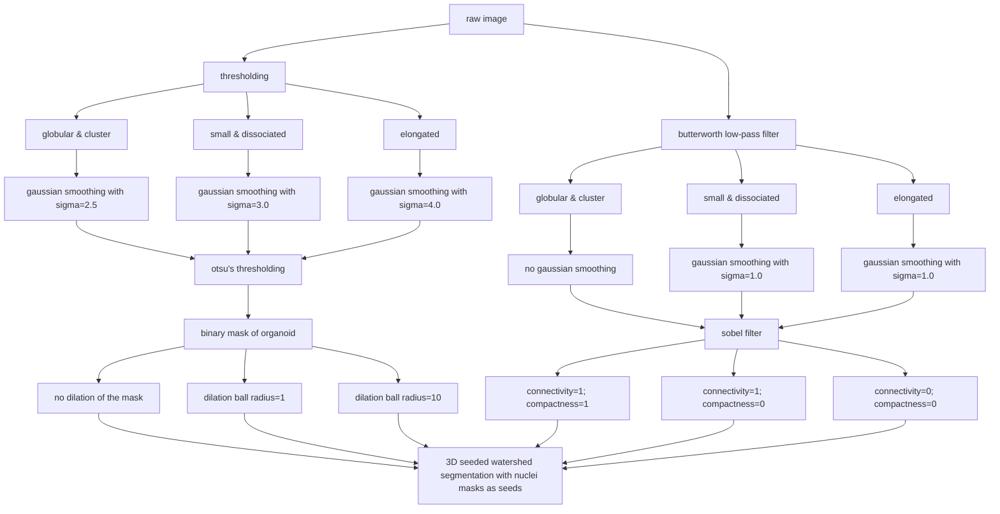
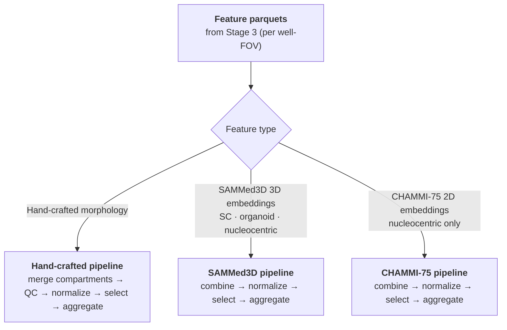
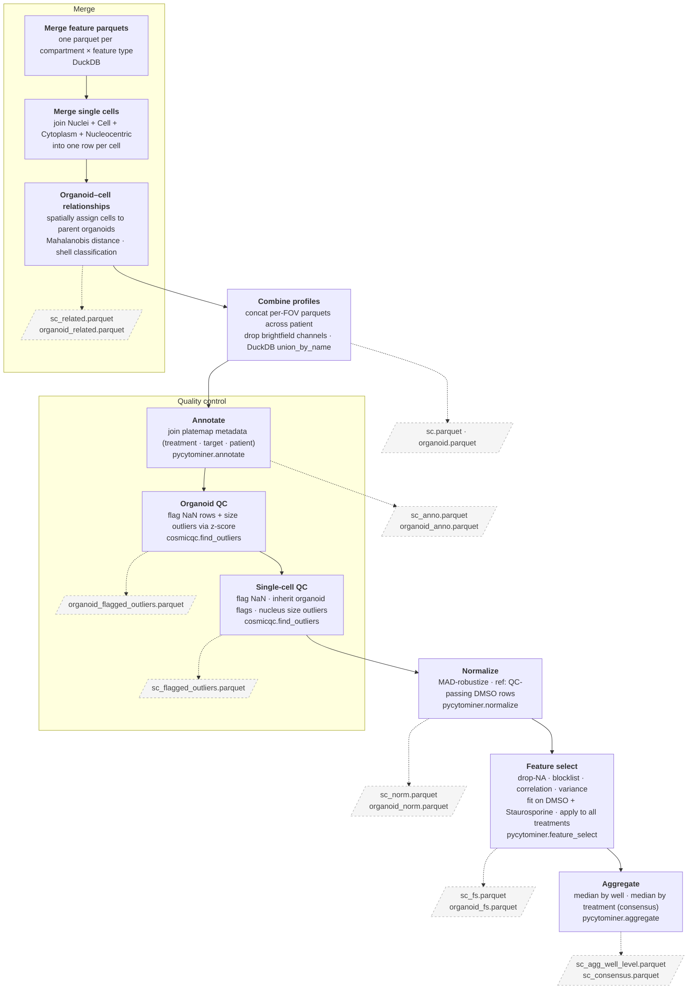
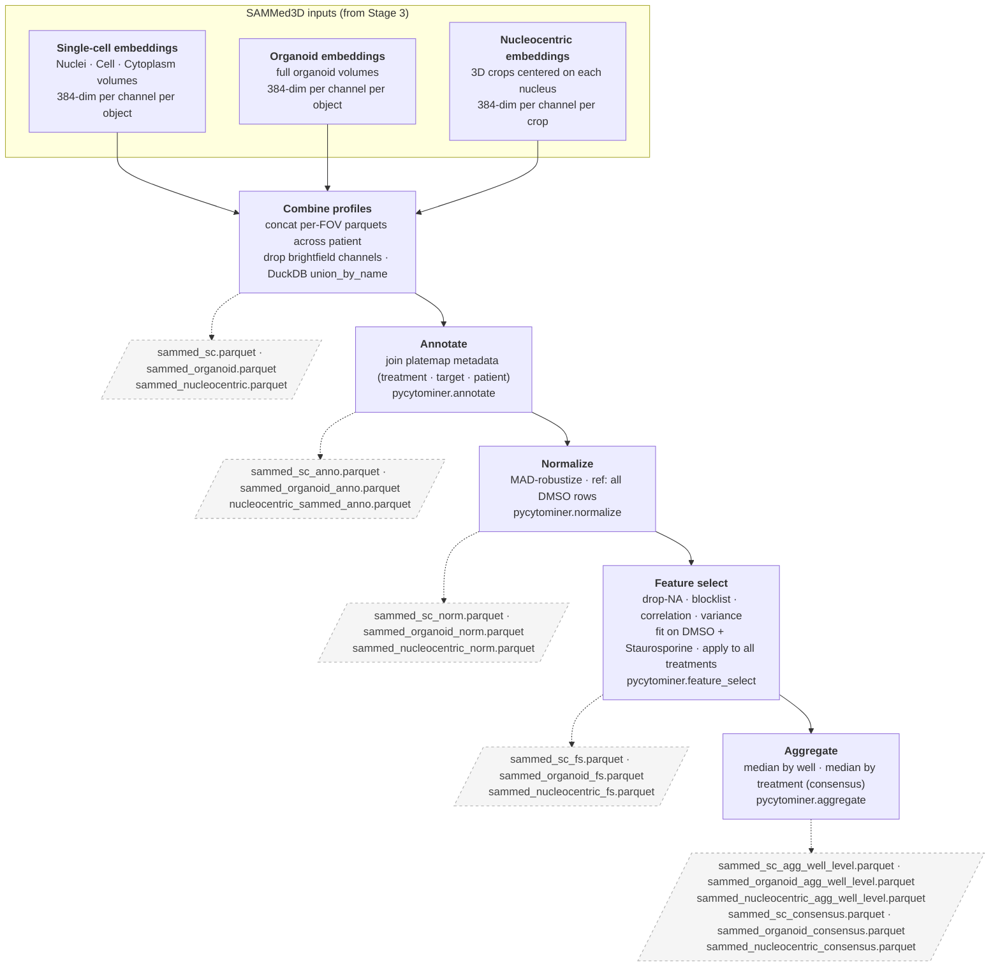
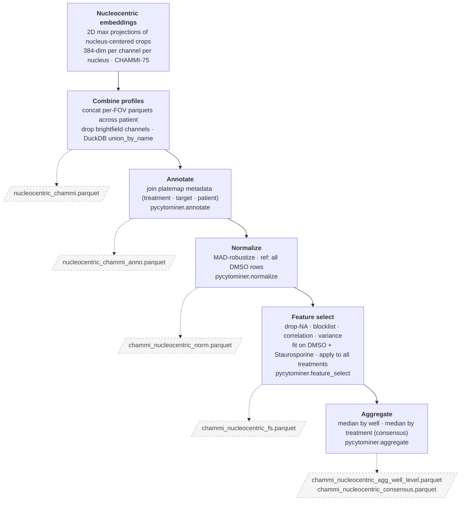

# Neurofibromatosis type 1 (NF1) 3D organoid image-based profiling pipeline

[](https://nf1-3d-organoid-profiling-pipeline.readthedocs.io/en/latest/?badge=latest)

Patients living with neurofibromatosis type 1 (NF1) often develop neurofibromas (nfs), which are complex and benign tumors that can transform into malignant disease.
However, there are only two FDA-approved therapies for NF1-associated inoperable plexiform neurofibromas (pnfs): mirdametinib and selumetinib. Thus, we **urgently need more therapeutic options** for neurofibromas.

To address this, we have developed a 3D patient-derived tumor organoid model of NF1. We developed a modified 3D cell painting protocol to generate
high-content imaging data from these organoids.
This repository contains the code and documentation for a comprehensive analysis pipeline to process and analyze these 3D organoid models of NF1.

This pipeline was developed specifically for the NF1 3D organoid dataset, but the modular design allows for adaptation to other 3D microscopy datasets.

## Example data

### Raw channels

| **405 channel** | **488 channel** | **555 channel** | **640 channel** |
| --------------- | --------------- | --------------- | --------------- |
|  |  |  |  |

### Organoid, nuclei, cell, and cytoplasm segmentations

| **Organoid** | **Nuclei** | **Cell** | **Cytoplasm** |
| ------------ | ---------- | -------- | ------------- |
|  |  |  |  |

---

## Pipeline architecture

The pipeline follows a hierarchical processing structure:

We present a full workflow to profile 3-dimensional images of organoids.
Our end-to-end system processes raw 3D microscopy data through illumination correction, segmentation, feature extraction, quality control, and image-based profiling.

**Execution strategy:**

- SLURM-based HPC scheduling for parallel processing
- Conditional execution based on file existence
- Automatic job submission throttling (max 990 concurrent jobs)


## Stage 0: data preprocessing

**Directory:** `0.preprocessing_data/`

**Purpose:** Transform raw microscopy data into standardized 3D z-stack images ready for analysis.

**Inputs:**

- Raw 2D TIFF images from microscope (5 channels × N z-slices × M wells)
- Metadata files (experiment design, plate layouts)

**Outputs:**

- 3D z-stack TIFF files organized by patient/well/FOV (optionally deconvolved)
- File structure: `data/{patient}/zstack_images/{well_fov}/{channel}.tif`

### Data preprocessing steps

1. **Patient-specific preprocessing**
   - We optimize formatting of raw images we receive fresh from our collaborator's microscope.
   - We organize raw image files by patient ID and create patient-specific directory structures.
   - We validate file naming conventions.
2. **Updating file structure**
   - We standardize the directory hierarchy across patients.
   - We rename files to a consistent naming scheme (to account for cross-batch inconsistencies).
3. **Creating z-stacks**
   - We combine 2D image slices into 3D z-stacks, built to accommodate different microscope formats (e.g., CQ1, echo)
   - This process maintain metadata and propagates channel information.
   - We track z-spacing between images (typically 1μm) as well as z-stack depth (between 50-100 slices [~50-100μm total])
4. **Detecting image corruption**
   - We validate TIFF file integrity removing corrupted images, incomplete z-stacks, and other errors introduced during image acquisition.
   - We flag problematic datasets by added QC flags to be used in downstream filtering (if necessary).
5. **Preprocessing for deconvolution (optional)**
   - We prepare images for huygens deconvolution (generating parameter files and organizing batch processing structure)
6. **Post-processing for deconvolution (optional)**
   - We import deconvolved images, verify output quality, and update file paths and metadata for downstream processing

**Execution:**

```bash
# Example for a specific patient (NF0014)
cd 0.preprocessing_data
python scripts/1.make_zstack_and_copy_over.py --patient NF0014_T1

# Process for the CQ1 microscope
python scripts/1z.make_zstack_and_copy_over_CQ1.py --patient NF0014_T1
```

## Stage 1: image quality control

**Directory:** `1.image_quality_control/`

**Inputs:**

- z-stack images from stage 0 (deconvolution optional)

**Outputs:**

- QC flags file: `data/{patient}/qc_flags.csv`
- QC reports: HTML/PDF summaries with plots
- Flagged well list for exclusion from downstream analysis

**Purpose:** Assess image quality and flag problematic well FOVs before segmentation.

### Image QC steps

1. **Cellprofiler QC pipeline**
   - Extract whole-image QC metrics using cellprofiler.
   - Export QC metrics to CSV.
     - These will be used in all downstream QC filtering steps.
2. **Blur evaluation**
   - Calculate laplacian variance for focus detection.
   - Identify out-of-focus z-slices.
   - Set thresholds for acceptable sharpness.
3. **Saturation analysis**
   - Detect overexposed pixels per channel.
   - Calculate percentage of saturated voxels.
   - Flag wells with excessive saturation (>5%).
4. **QC report generation**
   - Create visualizations with ggplot2 (R).
   - Generate per-plate and per-patient summaries.
   - Produce pass/fail flags for each well FOV.

**Quality metrics:**

- **Blur:** laplacian variance, focus score
- **Saturation:** percentage of pixels clipped at the maximum value
- **Signal-to-noise:** mean signal / background standard deviation
- **Illumination:** uniformity of pixel intensity across each FOV

**Execution:**

```bash
cd 1.image_quality_control
jupyter nbconvert --to notebook --execute notebooks/*.ipynb
```

## Stage 2: image segmentation

**Directory:** `2.segment_images/`

**Purpose:** Generate 3D masks for nuclei, cells, cytoplasm, and whole organoids.
We refer to each mask category as a "compartment".

### Image segmentation steps

1. **Nuclei segmentation**
   - Apply cellpose 4.0 on the DNA channel (405 nm).
   - Uses a custom function for 2.5D segmentation to handle z-stacks with varying slice counts.
2. **Organoid segmentation**
   - Use cellpose 3.x using a custom size invariant search algorithm.
3. **Cell segmentation**
   - Segment individual cells using F-actin and AGP channel (555 nm).
   - Expand from nuclear seeds.
   - Use 3D watershed for cell boundary detection.
4. **Cytoplasm derivation**
   - Subtract nuclear masks from cell masks
   - Generate cytoplasmic compartment masks
5. **Mask refinement**
   - Stitch 2D masks into 3D volumes
   - Match objects to retain the same ids across z-slices.
   - Assign nuclei to parent cells.
   - Assign cells to parent organoids.

**Execution:**

```bash
cd 2.segment_images
sbatch grand_parent_segmentation.sh
```

### Nuclei segmentation workflow diagram


### Cell segmentation workflow diagram



### Organoid segmentation

Organoid segmentation was performed using CellPose SAM on Gaussian-smoothed (sigma=10.0) AGP channel images with a size constraint of 200 pixel diameter.

## Stage 3: feature extraction

**Directory:** `3.cellprofiling/`

**Purpose:** Extract all morphology (hand-drawn) features (e.g., shape, intensity, texture, etc.) from segmented objects.

### Feature extraction steps

To maximize parallelization and processing speed, our featurization strategy follows a three-level hierarchical job submission structure.

1. **Level 1: all fovs for a patient, per well (grandparent process)**
   (`Run_featurization_grandparent.sh`)
   - Submits parent jobs for each FOV (level 2).
2. **Level 2: all feature categories for each FOV (parent process)**
   (`Run_featurization_parent.sh`)
   - Loops through all combinations of feature types × compartments × channels.
   - Submits child jobs for each feature combination (level 3).
3. **Level 3: compute specific feature categories (child process)**
   (Individual feature extraction scripts)
   - Calculates specific features based on the hierarchical combination specified in levels 1 and 2.
   - Saves individual feature calculation outputs as a parquet file within a folder to be combined later.

**Feature types:** For more details on feature types and extraction methods, refer to the `Features/` documentation.

### Feature extraction strategy

We extract hand-drawn features across multiple categories (e.g., shape, intensity, texture) for each compartment and channel combination.
In addition, we extract deep learning-based features using the sammed3d model to capture complex morphological phenotypes that may not be described by hand-crafted features.
Sammed3d features are extracted as 384-dimensional embeddings per channel per object using the CLS token output from the vit encoder on the whole volume.
Additionally, we take a `nucleocentric` feature extraction approach where we extract features from a cropped volumes centered around each nucleus.
We use sammed3d to extract features from these nucleocentric volumes, and we z-maximally project the nucleocentric volumes to extract 2D features using CHAMMI-75 features.
CHAMMI-75 features are extracted as 384-dimensional embeddings per channel per object using the CLS token output from a separate vit encoder.

### Feature extraction categories

| Feature type           | Description                                                     |
| ---------------------- | --------------------------------------------------------------- |
| Area + size            | object size, area, perimeter, etc.                              |
| Colocalization         | overlap of signals between channels (e.g., pearson correlation) |
| Intensity              | mean, median, max, min, etc. intensity values per object        |
| Granularity            | "granularity of pixel intensities"                              |
| Neighbors              | number of neighboring objects, distance to neighbors            |
| Texture                | haralick features, gabor filters, etc.                          |
| Deep learning features | sammed3d vit-based embeddings                                   |
| CHAMMI-75 features     | vit-based embeddings from nucleocentric 2D projections          |

## Stage 4: image-based profiling

**Directory:** `4.processing_image_based_profiles/`

**Purpose:** Merge, normalize, and aggregate features across wells and patients, preparing data for downstream analyses.

**Inputs:**

- Feature parquet files from stage 3
- Metadata: plate maps, treatment info, QC flags, etc.

**Outputs:**

Profiles are generated at multiple levels with profiles being generated for each profile type:

- **Single-cell hand-drawn features** one row per nucleus/cell/cytoplasm
- **Single-cell sammed3d features** one row per nucleus/cell/cytoplasm
- **Organoid hand-drawn features** one row per organoid
- **Organoid sammed3d features** one row per organoid
- **Nucleocentric sammed3d features** one row per nucleus-centered volume
- **Nucleocentric CHAMMI-75 features** one row per nucleus-centered volume

Profile types:

- **Object-level** standard scalar normalized profiles (one row per object with all features)
- **Object-level** feature-selected profiles (one row per object with selected features)
- **Well-level** aggregated profiles (one row per well with aggregated features)
- **Consensus profiles** aggregated profiles with selected features (one row per treatment with selected features)

With the combination of 6 profile types and 4 profile levels, we generate a total of 24 different profile outputs.
Each profile output is saved as a parquet file in the `data/{patient}/image_based_profiles/`.

### Pipeline overview

Three processing tracks run in parallel — hand-crafted morphology features, SAMMed3D deep learning embeddings, and CHAMMI-75 deep learning embeddings — each following a distinct path determined by how the features were extracted and which compartments they cover.



---

### Hand-crafted feature pipeline

Traditional morphology features (shape, intensity, texture, colocalization, neighbors, granularity) extracted per object across four segmented compartments: **Nuclei**, **Cell**, **Cytoplasm**, and **Organoid**. Single-cell profiles are formed by joining Nuclei + Cell + Cytoplasm features into one row per cell. A **nucleocentric** representation is also included — see the box below.

Hand-crafted features require merging across compartments and a two-stage QC cascade (organoid first, then single-cell inheriting organoid flags) before normalization.



---

### SAMMed3D pipeline

SAMMed3D is a 3D ViT-based model that extracts **384-dimensional embeddings** from the CLS token of the encoder, applied to whole 3D object volumes per fluorescence channel. It covers three object types:

- **Single cells** (Nuclei, Cell, Cytoplasm volumes)
- **Organoids** (full organoid volumes)
- **Nucleocentric volumes** — 3D crops centered on each segmented nucleus, extracted from the raw image across all channels. These crops capture the immediate cellular microenvironment around the nucleus without relying on cell or organoid segmentation boundaries.

SAMMed3D features are pre-computed per object in Stage 3 and do not require compartment merging or QC.



---

### CHAMMI-75 pipeline

CHAMMI-75 is a 2D ViT-based model that extracts **384-dimensional embeddings** from the CLS token of the encoder. It is applied exclusively to **nucleocentric volumes** — but unlike SAMMed3D, it operates on **2D maximum-intensity projections** of those volume crops rather than the full 3D crop. This collapses the z-axis and captures a 2D summary of the nuclear microenvironment per channel.

CHAMMI-75 features are pre-computed per nucleus in Stage 3 and do not require compartment merging or QC.



---

**Execution:**

```bash
cd 4.processing_image_based_profiles
sbatch merge_features_grand_parent.sh
```

## Data organization

### Directory structure

The pipeline expects data organized in this hierarchy:

```text
NF1_3D_organoid_profiling_pipeline/
├── data/
│   ├── patient_IDs.txt
│   ├── NF0014_T1/
│   │   ├── zstack_images/
│   │   │   ├── C4-2/
│   │   │   │   ├── 405.Tif        # DNA channel
│   │   │   │   ├── 488.Tif        # ER channel
│   │   │   │   ├── 555.Tif        # golgi channel
│   │   │   │   ├── 568.Tif        # F-actin channel
│   │   │   │   └── 640.Tif        # mito channel
│   │   │   └── ... (Other well fovs)
│   │   ├── segmentation_masks/
│   │   │   ├── C4-2/
│   │   │   │   ├── Organoid_mask.tif
│   │   │   │   ├── Nuclei_mask.tif
│   │   │   │   ├── Cell_mask.tif
│   │   │   │   └── Cytoplasm_derived.tif
│   │   │   └── ... (Other well fovs)
│   │   ├── extracted_features/
│   │   │   ├── C4-2/
│   │   │   │   ├── AreaSizeShape_Nuclei_DNA_CPU.parquet
│   │   │   │   ├── Intensity_Cell_488_GPU.parquet
│   │   │   │   ├── Texture_Cytoplasm_640_CPU.parquet
│   │   │   │   └── ... (125-189 Files)
│   │   │   └── ...
│   │   ├── image_based_profiles/
│   │   │   ├── 0.converted_profiles/
│   │   │   │   ├── C4-2/
│   │   │   │   │   ├── sc_related.parquet
│   │   │   │   │   └── organoid_related.parquet
│   │   │   ├── 1.combined_profiles/
│   │   │   │   ├── sc.parquet
│   │   │   │   └── organoid.parquet
│   │   │   ├── 2.annotated_profiles/
│   │   │   ├── 3.normalized_profiles/
│   │   │   ├── 4.feature_selected_profiles/
│   │   │   └── 5.aggregated_profiles/
│   │   └── qc_flags.parquet
│   ├── NF0016_T1/
│   │   └── ... (Same structure)
│   └── all_patient_profiles/
│       ├── sc_consensus.parquet
│       ├── organoid_consensus.parquet
│       ├── well_aggregated.parquet
│       └── patient_aggregated.parquet
├── models/
│   └── sam-med3d-turbo.pth
├── environments/
│   ├── GFF_preprocessing.yml
│   ├── GFF_segmentation.yml
│   └── ... (Conda environments)
└── ... (Code directories 0-6)
```

## File naming conventions

**Z-stack images:**

- Format: `{channel}.tif` where channel ∈ {405, 488, 555, 640}
- Dimensions: (Z, Y, X)
- Data type: uint16

**Segmentation masks:**

- Format: `{compartment}_mask.tif`
- Compartments: {organoid, nuclei, cell, cytoplasm}
- Label encoding: integer object ids (0=background, 1-N=objects)

**Feature files:**

- Format: `{feature}_{compartment}_{channel}_{processor}_features.parquet`
- Example: `Intensity_Nuclei_405_GPU_features.parquet`

**Profile files:**

- Format: parquet (compressed columnar storage)
- Naming: `{level}_{aggregation}.parquet`
- Example: `sc_consensus.parquet`

## Channel information

The pipeline processes four fluorescent imaging channels:
Note that while these are the channels we have used for our NF1 3D organoid dataset, the pipeline is designed to be flexible and adaptable to other channel configurations as needed. the channel information is stored in the metadata and used throughout the pipeline to ensure correct processing and feature extraction for each channel.

| Name | fluorophore          | ex(nm) | em(nm) | dichroic | target       | organelle         |
| ---- | -------------------- | ------ | ------ | -------- | ------------ | ----------------- |
| 405  | Hoechst 33342        | 361    | 486    | 405      | DNA          | nucleus           |
| 488  | Cona alexa fluor 488 | 495    | 519    | 488      | ER           | ER                |
| 555  | WGA alexa fluor 555  | 555    | 580    | 555      | membranes    | golgi/plasma memb |
| 640  | Mitotracker deep red | 644    | 665    | 640      | mitochondria | mitochondria      |

**Imaging parameters:**

- Objective: 60x/1.35 NA oil immersion
- Oil RI: 1.518
- Voxel size: 0.108 μm (XY) × 1 μm (Z)
- Bit depth: 16-bit
- Dynamic range: 0-65535

## Computational specifications

### Hardware

### Local

- CPU: 24 cores @ 2.5 ghz
- RAM: 128 GB
- Storage: 20 TB free space
- GPU: NVIDIA geforce 3090Ti with 24 GB VRAM for acceleration

### HPC (SLURM)

- Nodes: 100s of CPU compute nodes
- Partition: amilan (CPU), aa100 (GPU)
- QOS: normal (24h), long (7 days)
- Max concurrent jobs: 990 per user

### Environment setup

We recommend using `uv`, `mamba` or `conda` to create the required environments. we have written a `makefile` to help with conda environment creation and management.

```bash
cd environments || exit
make --always-make
cd .. || exit
```

For `uv` users, you can also create the environments with:

```bash
source uv_setup.sh
```

### Python utilities (monorepo layout)

The utilities under `utils/src/` are now structured as installable packages.
For local development, install them in editable mode:

```bash
cd utils
pip install -e .
```

Note that the utilites should be imported into compute environments. see the
`Environments` module for installing the utils. there is a makefile in the
`Environments` module that installs the environments with utils.

### System requirements

- Linux-based OS
- HPC/SLURM environment recommended for large-scale runs
- At least multiple tbs of storage for raw and processed images
- Sufficient RAM and CPU/GPU resources depending on dataset size
  - We recommend at least 128GB RAM and multiple CPU cores for image processing steps
  - Though we have been able to get RAM usage under 8GB per well_fov by distributing the compute.
    - Please note that this RAM usage is highly dependent on the number of z-slices, image dimensions, and number of channels.
    - Here we generally have 30-50 z-slices, ~1500x1500 pixel images, and 4 channels. we rarely exceed 100 z-slices. additionally, scaling in z-slices will require more compute time and RAM.
- Optional: GPU resources for segmentation and deep learning based feature extraction
  - We have found that a NVIDIA 3090 TI (24GB VRAM) is more than enough for our segmentation tasks.
  - It is important to note that part of the advantage of using 2.5D segmentation is that it greatly reduces the GPU VRAM requirements
    compared to full 3D segmentation - especially as z-slice count scales up.

**Storage requirements:**

- Raw images: 250-500 MB/well FOV
- Z-stacks: 250-500 MB/well FOV
- Masks: 250-500 MB/well FOV
- Features: 5-10 MB/well FOV
- Profiles: 1-5 MB/well FOV
- **Total: ~1-2 GB/well FOV**

Number of fovs per well varies between 7-25 with typically 60 wells per patient.
Per patient well fovs can range from 420 to 1500 depending on the experiment design.

**Storage estimates (per patient):**

| Well fovs | storage (TB) |
| --------- | ------------ |
| 400       | ~0.4-0.8     |
| 500       | ~0.5-1.0     |
| 1000      | ~1.0-2.0     |
| 1500      | ~1.5-3.0     |

### Data availability

The raw and processed imaging data are not quite publicly available at this time.
We will have data available at some point on the NF data portal via Synapse.

## Associated repositories

For more information on the NF1 organoid profiling project, please see the following associated repositories:

- [NF1 3D organoid profiling
  Pipeline](https://github.com/wayscience/NF1_3D_organoid_profiling_pipeline)
  - This repository (code and documentation for the pipeline)
- [NF1 2D organoid profiling
  Pipeline](https://github.com/wayscience/NF1_2D_organoid_profiling_pipeline)
  - Pipeline for 2D organoid profiling
- [NF1 organoid profile
  Analysis](https://github.com/wayscience/NF1_organoid_profile_analysis)
  - Downstream analysis of the generated profiles

## Citation

If you use this pipeline in your research, please cite it using the metadata in [CITATION.cff](https://github.com/WayScience/NF1_3D_organoid_profiling_pipeline/blob/main/CITATION.cff).
