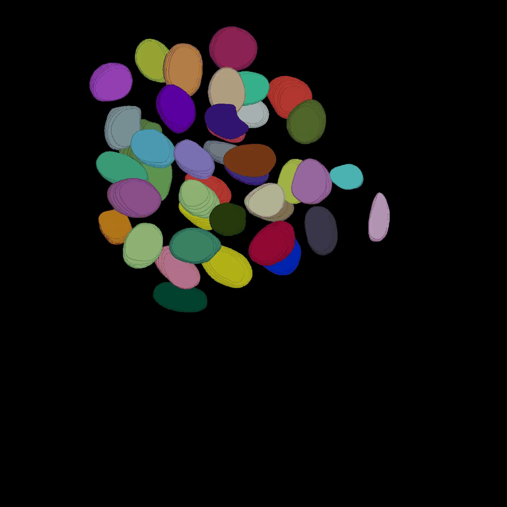
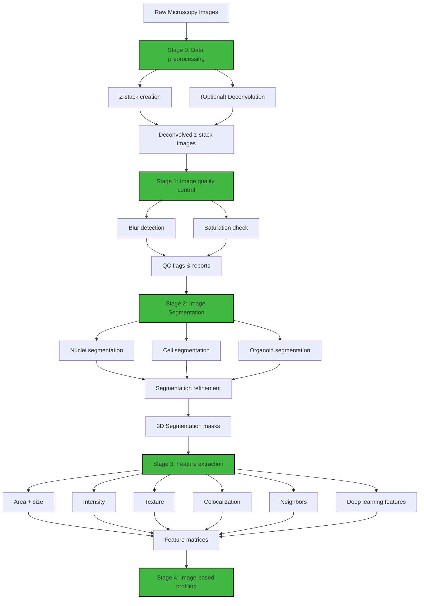
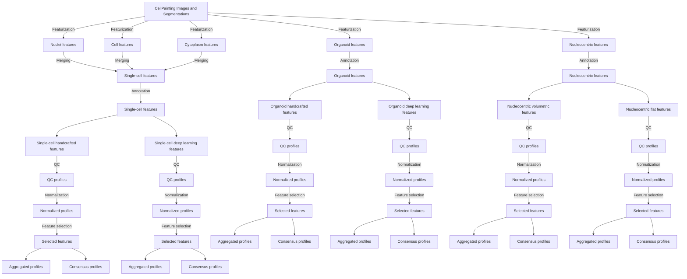

[](https://nf1-3d-organoid-profiling-pipeline.readthedocs.io/en/latest/?badge=latest)

# Neurofibromatosis Type 1 (NF1) 3D organoid image-based profiling pipeline

Patients living with Neurofibromatosis Type 1 (NF1) often develop neurofibromas (NFs), which are complex benign tumors.
However, there are only two FDA-approved therapies for NF1-associated inoperable plexiform neurofibromas (PNFs): Mirdametinib and Selumetinib.
Thus, we **urgently need more therapeutic options** for neurofibromas.

To address this, we have developed a 3D patient-derived tumor organoid model of NF1.
We developed a modified 3D Cell Painting protocol to generate high-content imaging data from these organoids.
This repository contains the code and documentation for a comprehensive analysis pipeline to process and analyze these 3D organoid models of NF1 NFs.

This pipeline was developed specifically for the NF1 3D organoid dataset, but the modular design allows for adaptation to other 3D microscopy datasets.

## Raw channels
| 405 | 488 | 555 | 640 |
|:-:|:-:|:-:|:-:|
|  |  |  |  |

## Organoid, Nuclei, Cell, and Cytoplasm Segmentations

| Organoid | Nuclei | Cell | Cytoplasm |
|:-:|:-:|:-:|:-:|
|  |  |  |  |

---

We present a full workflow to profile 3-dimensional images of organoids.
Our end-to-end system processes raw 3D microscopy microscopy data through illumination correction, segmentation, feature extraction, quality control, and image-based profiling.



# Pipeline architecture

The pipeline follows a hierarchical processing structure:

**Execution strategy:**

- SLURM-based HPC scheduling for parallel processing
- Conditional execution based on file existence
- Automatic job submission throttling (max 990 concurrent jobs)

# Detailed workflow stages

## Stage 0: Data preprocessing

**Directory:** `0.preprocessing_data/`

**Purpose:** Transform raw microscopy data into standardized 3D z-stack images ready for analysis.

**Inputs:**

- Raw 2D TIFF images from microscope (5 channels × N z-slices × M wells)
- Metadata files (experiment design, plate layouts)

**Outputs:**

- 3D z-stack TIFF files organized by patient/well/FOV (optionally deconvolved)
- File structure: `data/{patient}/zstack_images/{well_fov}/{channel}.tif`

### Data preprocessing steps

1. **Patient-specific preprocessing**
   - We optimize formatting of raw images we recieve fresh from our collaborator's microscope.
   - We organize raw image files by patient ID and create patient-specific directory structures.
   - We validate file naming conventions.
2. **Updating file structure**
   - We standardize the directory hierarchy across patients.
   - We rename files to a consistent naming scheme (to account for cross-batch inconsistencies).
3. **Creating z-stacks**
   - We combine 2D image slices into 3D z-stacks, built to accommodate different microscope formats (e.g., CQ1, Echo)
   - This process maintain metadata and propagates channel information.
   - We track z-spacing between images (typically 1μm) as well as z-stack depth (between 50-100 slices [~50-100μm total])
4. **Detecting image corruption**
   - We validate TIFF file integrity removing corrupted images, incomplete stacks, and other errors introduced during image acquisition.
   - We flag problematic datasets.
5. **Preprocessing for deconvolution (Optional)**
   - We prepare images for Huygens deconvolution (generating parameter files and organizing batch processing structure)
6. **Post-processing for deconvolution (Optional)**
   - We import deconvolved images, verify output quality, and update file paths and metadata for downstream processing

**Key Parameters:**

- Objective: 60x/1.35 NA oil immersion
- Oil RI: 1.518
- Voxel size: ~0.1 μm (XY) × 1 μm (Z)

**Execution:**

```bash
# Example for a specific patient (NF0014)
cd 0.preprocessing_data
python scripts/1.make_zstack_and_copy_over.py --patient NF0014_T1

# Process for the CQ1 microscope
python scripts/1z.make_zstack_and_copy_over_CQ1.py --patient NF0014_T1
```

## Stage 1: Image quality control

**Directory:** `1.image_quality_control/`

**Inputs:**
- Z-stack images from Stage 0 (deconvolution optional)

**Outputs:**

- QC flags file: `data/{patient}/qc_flags.csv`
- QC reports: HTML/PDF summaries with plots
- Flagged well list for exclusion from downstream analysis

**Purpose:** Assess image quality and flag problematic well FOVs before segmentation.

### Image QC steps

1. **CellProfiler QC pipeline**
   - Extract whole-image QC metrics using CellProfiler.
   - Compute per-slice statistics.
   - Export QC metrics to CSV.
2. **Blur evaluation**
   - Calculate Laplacian variance for focus detection.
   - Identify out-of-focus z-slices.
   - Set thresholds for acceptable sharpness.
3. **Saturation analysis**
   - Detect overexposed pixels per channel.
   - Calculate percentage of saturated voxels.
   - Flag wells with excessive saturation (>5%).
4. **QC report generation**
   - Create visualizations with ggplot2 (R).
   - Generate per-plate and per-patient summaries.
   - Produce pass/fail flags for each well FOV.

**Quality Metrics:**

- **Blur:** Laplacian variance, focus score
- **Saturation:** Percentage of pixels clipped at the maximum value
- **Signal-to-noise:** Mean signal / background standard deviation
- **Illumination:** Uniformity of pixel intensity across each FOV

**Execution:**

```bash
cd 1.image_quality_control
jupyter nbconvert --to notebook --execute notebooks/*.ipynb
```

## Stage 2: Image segmentation

**Directory:** `2.segment_images/`

**Purpose:** Generate 3D masks for nuclei, cells, cytoplasm, and whole organoids. We refer to each mask category as a "compartment".

### Image segmentation Steps

1. **Nuclei segmentation**
   - Apply Cellpose 4.0 on the DNA channel (405 nm).
2. **Organoid segmentation**
   - Use cellpose 3.x using a custom size invariant search algorithm.
3. **Cell segmentation**
   - Segment individual cells using F-actin and AGP channel (555 nm).
   - Expand from nuclear seeds.
   - Use 3D watershed for cell boundary detection.
4. **Cytoplasm derivation**
   - Subtract nuclear masks from cell masks
   - Generate cytoplasmic compartment masks
5. **Mask refinement**
   - Stitch 2D masks into 3D volumes
   - Match objects to retain the same IDs across z-slices.
   - Assign nuclei to parent cells.
   - Assign cells to parent organoids.

**Execution:**

```bash
cd 2.segment_images
sbatch grand_parent_segmentation.sh
```

## Stage 3: Feature extraction

**Directory:** `3.cellprofiling/`

**Purpose:** Extract all morphology features(e.g., shape, intensity, texture, etc.) from segmented objects.

### Feature extraction steps

To maximize parallelization and processing speed, our featurization strategy follows a three-level hierarchical job submission structure.

1. **Level 1: All FOVs for a patient, per well (Grandparent process)** (`run_featurization_grandparent.sh`)
  - Submits parent jobs for each FOV (level 2).
3. **Level 2: All feature categories for each FOV (Parent process)** (`run_featurization_parent.sh`)   - Loops through all combinations of feature types × compartments × channels.
   - Submits child jobs for each feature combination (level 3).
3. **Level 3: Compute specific feature categories (Child process)** (Individual feature extraction scripts)
   - Calculates specific features based on the hierarchical combination specified in levels 1 and 2.
   - Saves individual feature calculation outputs as a parquet file within a folder to be combined later.

**Feature types:**
For more details on feature types and extraction methods, refer to `extraction_math` or the `features/` documentation.

## Stage 4: Image-based profiling

**Directory:** `4.processing_image_based_profiles/`

**Purpose:** Merge, normalize, and aggregate features across wells and patients, preparing data for downstream analyses.

**Inputs:**

- Feature parquet files from Stage 3
- Metadata: plate maps, treatment info, QC flags, etc.

**Outputs:**

- `data/{patient}/image_based_profiles/sc.parquet` - Single-cell profiles
- `data/{patient}/image_based_profiles/organoid.parquet` - Organoid profiles
- `data/all_patient_profiles/sc_consensus.parquet` - Cross-patient SC
- `data/all_patient_profiles/organoid_consensus.parquet` - Cross-patient organoid
- `data/all_patient_profiles/well_aggregated.parquet` - Well-level
- `data/all_patient_profiles/patient_aggregated.parquet` - Patient-level

**Output Levels:**

- **Single-cell:** One row per nucleus/cell
- **Organoid:** One row per organoid (aggregated from cells)
- **Well:** One row per well FOV (aggregated from organoids)
- **Patient:** One row per patient/treatment (aggregated from wells)

### Image-based profiling workflow

## File and information flow diagram



1. **Feature Merging**
   - Combine all feature CSVs per well FOV
   - Use cytotable for SQLite → Parquet conversion
   - Create single-cell (sc) and organoid-level profiles
2. **Annotation**
   - Add treatment metadata from plate maps
   - Link drug names, targets, concentrations
   - Add patient genotype information
3. **Normalization**
   - Z-score normalization per plate
   - Standardize features: `(x - μ) / σ`
   - Handle batch effects
4. **Feature Selection**
   - Remove low-variance features
   - Filter correlated features (correlation > 0.9)
   - Drop blocklisted features
   - Apply frequency cutoff for categorical features
5. **Aggregation**
   - Calculate well-level statistics (mean, median, std)
   - Generate organoid-parent aggregations
   - Compute patient-level summaries
6. **Consensus Profiles**
   - Merge sc and organoid aggregations
   - Create hierarchical profile structure
   - Export final consensus matrices
7. **QC Filtering**
   - Apply image QC flags from Stage 1
   - Remove outlier objects (z-score > 3)
   - Filter low-quality wells
8. **Create all analysis ready output files**
   - Merge profiles across all patients
   - Apply global feature selection
   - Generate all-patient consensus profiles

**Feature Selection Parameters:**

- Correlation threshold: 0.9
- Variance threshold: 0.01
- NA cutoff: 5%
- Frequency cut: 0.1
- Unique cut: 0.1

**Execution:**

```bash
cd 4.processing_image_based_profiles
sbatch merge_features_grand_parent.sh
```

# Data organization

## Directory structure

The pipeline expects data organized in this hierarchy:

```text
NF1_3D_organoid_profiling_pipeline/
├── data/
│   ├── patient_IDs.txt
│   ├── NF0014_T1/
│   │   ├── zstack_images/
│   │   │   ├── C4-2/
│   │   │   │   ├── 405.tif        # DNA channel
│   │   │   │   ├── 488.tif        # ER channel
│   │   │   │   ├── 555.tif        # Golgi channel
│   │   │   │   ├── 568.tif        # F-actin channel
│   │   │   │   └── 640.tif        # Mito channel
│   │   │   └── ... (other well FOVs)
│   │   ├── segmentation_masks/
│   │   │   ├── C4-2/
│   │   │   │   ├── organoid_mask.tif
│   │   │   │   ├── nuclei_mask.tif
│   │   │   │   ├── cell_mask.tif
│   │   │   │   └── cytoplasm_derived.tif
│   │   │   └── ... (other well FOVs)
│   │   ├── extracted_features/
│   │   │   ├── C4-2/
│   │   │   │   ├── AreaSizeShape_Nuclei_DNA_CPU.parquet
│   │   │   │   ├── Intensity_Cell_488_GPU.parquet
│   │   │   │   ├── Texture_Cytoplasm_640_CPU.parquet
│   │   │   │   └── ... (125-189 files)
│   │   │   └── ...
│   │   ├── image_based_profiles/
│   │   │   ├── 0.converted_profiles/
│   │   │   │   ├── C4-2/
│   │   │   │   │   ├── sc_related.parquet
│   │   │   │   │   └── organoid_related.parquet
│   │   │   ├── 1.combined_profiles/
│   │   │   │   ├── sc.parquet
│   │   │   │   └── organoid.parquet
│   │   │   ├── 2.annotated_profiles/
│   │   │   ├── 3.normalized_profiles/
│   │   │   ├── 4.feature_selected_profiles/
│   │   │   └── 5.aggregated_profiles/
│   │   └── qc_flags.parquet
│   ├── NF0016_T1/
│   │   └── ... (same structure)
│   └── all_patient_profiles/
│       ├── sc_consensus.parquet
│       ├── organoid_consensus.parquet
│       ├── well_aggregated.parquet
│       └── patient_aggregated.parquet
├── models/
│   └── sam-med3d-turbo.pth
├── environments/
│   ├── GFF_preprocessing.yml
│   ├── GFF_segmentation.yml
│   └── ... (conda environments)
└── ... (code directories 0-6)
```

## File naming conventions

**Z-stack images:**

- Format: `{channel}.tif` where channel ∈ {405, 488, 555, 568, 640}
- Dimensions: (Z, Y, X)
- Data type: uint16

**Segmentation masks:**

- Format: `{compartment}_mask.tif`
- Compartments: {organoid, nuclei, cell, cytoplasm}
- Label encoding: Integer object IDs (0=background, 1-N=objects)

**Feature files:**

- Format: `{feature}_{compartment}_{channel}_{processor}_features.parquet`
- Example: `Intensity_Nuclei_405_GPU_features.parquet`

**Profile files:**

- Format: Parquet (compressed columnar storage)
- Naming: `{level}_{aggregation}.parquet`
- Example: `sc_consensus.parquet`

# Channel information

The pipeline processes five fluorescent imaging channels:

| Name | Fluorophore | Ex(nm) | Em(nm) | Dichroic | Target | Organelle |
|------|-------------|--------|--------|----------|--------|-----------|
| 405  | Hoechst 33342        | 361    | 486    | 405      | DNA            | Nucleus           |
| 488  | ConA Alexa Fluor 488 | 495    | 519    | 488      | ER             | ER                |
| 555  | WGA Alexa Fluor 555  | 555    | 580    | 555      | Membranes      | Golgi/Plasma Memb |
| 568  | Phalloidin AF 568    | 578    | 600    | 555      | F-actin        | Cytoskeleton      |
| 640  | MitoTracker Deep Red | 644    | 665    | 640      | Mitochondria   | Mitochondria      |

**Imaging parameters:**

- Objective: 60x/1.35 NA oil immersion
- Oil RI: 1.518
- Voxel size: 0.108 μm (XY) × 1 μm (Z)
- Bit depth: 16-bit
- Dynamic range: 0-65535

# Computational specifications

## Hardware

**Local**

- CPU: 24 cores @ 2.5 GHz
- RAM: 128 GB
- Storage: 20 TB free space
- GPU: NVIDIA GeForce 3090Ti with 24 GB VRAM for acceleration

**HPC (SLURM):**

- Nodes: 100s of CPU compute nodes
- Partition: amilan (CPU), aa100 (GPU)
- QOS: normal (24h), long (7 days)
- Max concurrent jobs: 990 per user

## Software environment

### Environment Setup

We recommend using `uv`, `mamba` or `conda` to create the required environments.
We have written a `makefile` to help with conda environment creation and management.

```bash
cd environments || exit
make --always-make
cd .. || exit
```

For `uv` users, you can also create the environments with:

```bash
source uv_setup.sh
```

### Python utilities (monorepo layout)

The utilities under `utils/src/` are now structured as installable packages. For local development, install them in editable mode:

```bash
cd utils
pip install -e .
```

Note that the utilites should be imported into compute environments.
See the `environments` module for installing the utils.
There is a Makefile int the `environments` module that installs the environemnts with utils.

### System Requirements

- Linux-based OS
- HPC/SLURM environment recommended for large-scale runs
- At least multiple TBs of storage for raw and processed images
- Sufficient RAM and CPU/GPU resources depending on dataset size
  - We recommend at least 128GB RAM and multiple CPU cores for image processing steps
  - Though we have been able to get RAM usage under 8GB per well_fov by distubuting the compute.
    - Please note that this RAM usage is highly dependent on the number of z-slices, image dimensions, and number of channels.
    - Here we generally have 30-50 z-slices, ~1500x1500 pixel images, and 4 channels. We rarly exceed 100 z-slices. Additionally scaling in z-slices will require more compute time and RAM.
- Optional: GPU resources for segmentation and deep learning based feature extraction
  - We have found that a NVIDIA 3090 TI (24GB VRAM) is more than enough for our segmentation tasks.
  - It is important to note that part of the advantage of using 2.5D segmentation is that it greatly reduces the GPU VRAM requirements compared to full 3D segmentation - especially as z-slice count scales up.

**Storage requirements:**

- Raw images: 250-500 MB/well FOV
- Z-stacks: 250-500 MB/well FOV
- Masks: 250-500 MB/well FOV
- Features: 5-10 MB/well FOV
- Profiles: 1-5 MB/well FOV
- **Total: ~1-2 GB/well FOV**

Number of FOVs per well varies between 7-25 with typically 60 wells per patient.
Per patient well FOVs can range from 420 to 1500 depending on the experiment design.

**Storage estimates (per patient):**

| Well FOVs | Storage (TB) |
|-----------|--------------|
| 400       | ~0.4-0.8     |
| 500       | ~0.5-1.0     |
| 1000      | ~1.0-2.0     |
| 1500      | ~1.5-3.0     |

### Data Availability

The raw and processed imaging data are not quite publicly available at this time.
We will have data available at some point on the NF Data Portal via synapse.

## Associated repositories

- [NF1 3D organoid profiling pipeline](https://github.com/WayScience/NF1_3D_organoid_profiling_pipeline) - This repository (code and documentation for the pipeline)
- [NF1 2D organoid profiling pipeline](https://github.com/WayScience/NF1_2D_organoid_profiling_pipeline) - Pipeline for 2D organoid profiling
- [NF1 organoid profile analysis](https://github.com/WayScience/NF1_organoid_profile_analysis) - Downstream analysis of the generated profiles

This landing page is shared with the 3D profiling pipeline repo and documentation.
In case you are reading this on the repo landing page, you can find the documentation for the 3D profiling pipeline at: <https://nf1-3d-organoid-profiling-pipeline.readthedocs.io/en/latest/?badge=latest>
