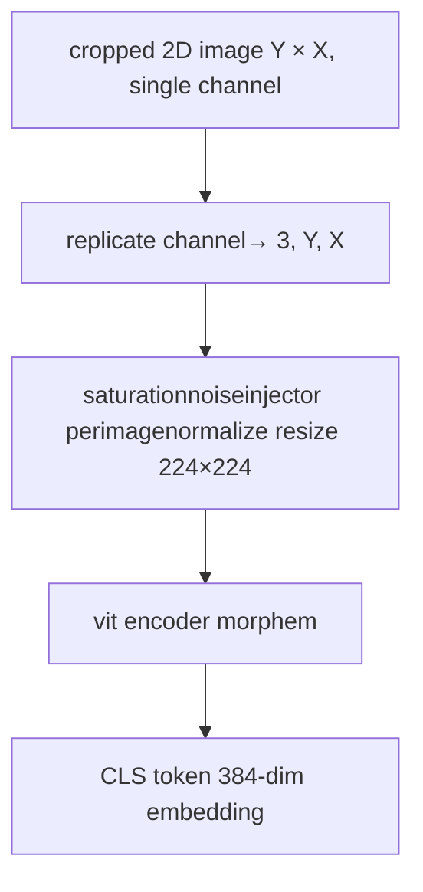

# CHAMMI-75 features

## Description

CHAMMI-75 features are deep learning-based embeddings extracted using
[Morphem](https://huggingface.co/caicedolab/morphem), a self-supervised vision
Transformer (vit) model pre-trained on the CHAMMI benchmark dataset of
Fluorescence microscopy images.

DOI: <https://doi.org/10.1038/s41592-024-02349-9>

## Architecture

The model uses a **bag-of-channels (boc)** strategy:

- Each fluorescence channel is treated as an independent grayscale image
- The single channel is replicated into 3 copies to satisfy the vit's RGB input requirement
- The vit encoder processes each channel independently
- The **CLS token** output (384-dimensional) is extracted as the feature vector per channel per object

## Pre-processing pipeline

As CHAMMI recommends, before passing images to the model, we apply three transforms in sequence:

1. **Saturationnoiseinjector** – saturated pixels (value = 255) in the input
   Channel are replaced with uniform random noise sampled from `[200, 255]`.
   This prevents the model from learning artefacts caused by pixel saturation.

2. **Perimagenormalize** – each image shape and format is normalized independently using
   `Instancenorm2d`.

3. **Resize** – the image is resized to 224 × 224 pixels to match the vit
   Input resolution.

## Features extracted

| Feature             | description                                                 |
| ------------------- | ----------------------------------------------------------- |
| CHAMMI1 – CHAMMI384 | CLS-token embedding dimensions from the morphem vit encoder |

Currently **384 features** are extracted per channel per object.

## Applications

CHAMMI-75 features are useful for:

- Capturing phenotypes that are missed by hand-crafted features.
- Identifying subtle treatment effects in fluorescence images.
- Downstream classification tasks.

## References

- <Https://arxiv.org/abs/2512.20833>
- Hugging face model card: <https://huggingface.co/caicedolab/morphem>
