# Future processing plan

This repository defines the NF1 3D organoid image-processing workflow, including segmentation, feature extraction, QC, profile preparation, and warehouse validation.
This plan covers both the **current-data reprocessing exercise** and the **future processing pattern for new data**.
Short term, the work pilots the new workflow and warehouse structure on representative current data before expanding to the current production dataset.
Mid term, the same workflow shape becomes the default for new patients, new plates, and later backfills.
The workflow will write a **bioimage profiling warehouse with a small manifest file** so every image, object, whole-image QC result, single-cell/object QC result, feature table, and patient annotation can be joined by stable identifiers without a bespoke database service.
The manifest is a JSON index that records the active warehouse location, table paths, schemas, source assets, and run provenance.
The design follows the [iceberg-bioimage warehouse specification][iceberg-warehouse], uses [OME-Arrow][ome-arrow] where image payloads or chunk metadata need tabular access, and uses [**ZedProfiler**][zedprofiler] as the feature extractor for morphology profiles.
ZedProfiler's [feature naming convention][zedprofiler-features] is the column standard for profile outputs.
ZedProfiler outputs are written as warehouse profile tables whose `Metadata_*` join keys connect features back to images, masks, QC records, and patients.

## Target warehouse structure

This section defines where shared outputs live, which tables are required, and which identifiers must be present so images, QC, features, and patient annotations can be joined.
The shared warehouse lives on **Isilon** (also known as Dell PowerScale), a shared network storage used for durable project data, when that storage is available to the compute environment.
For Alpine or other HPC environments without Isilon access, the warehouse can live under the repository's gitignored **`data/`** directory as a local execution target.
The repository tracks workflow code, schema definitions, validation code, configuration, and small reference manifests that point to the active warehouse location.
Each warehouse root contains Parquet-first tables plus **`warehouse_manifest.json`**.
That file lists the warehouse root, table names, table paths or URI prefixes, schema versions, required join keys, source image roots, run IDs, git commit or container metadata, row counts, and validation status.
**OME-TIFF** or **OME-Zarr** remain the source image assets when that is sufficient; **OME-Arrow** is reserved for derived crops, chunk indexes, or image tensors that need to be joined and filtered with profiles in DuckDB.
The [OME-Arrow benchmarks][ome-arrow-benchmarks] justify this selective use: reported results include faster bulk image reads and writes for Arrow-backed layouts, a roughly millisecond-scale NF1 feature-to-image join, and faster metadata scans than converted OME-Zarr metadata.

Required namespaces and tables:

- `images.image_assets`: one row per image asset with `Metadata_Biology_PatientTumor`, `Metadata_Biology_PatientID`, `Metadata_Experiment_PlateID`, `Metadata_Experiment_WellID`, `Metadata_Imaging_FieldID`, `Metadata_Imaging_ImageID`, channel, z/t/c/y/x shape, dtype, source URI, and processing provenance.
- `quality_control.image_qc`: candidate whole-image blur, saturation, module-error, and exclusion flags generated before segmentation and featurization, keyed by `Metadata_Imaging_ImageID`, with patient, well, and field metadata repeated only when useful for reading.
  Initial records are derived from the existing CellProfiler `MeasureImageQuality` outputs where available, and the pilot hardens this into a reproducible 3D whole-image QC stage with canonical metrics and thresholds.
- `quality_control.segmentation_qc`: mask existence, object counts, object geometry, parent-child consistency, and crop-readiness flags generated after 3D segmentation and before feature extraction, keyed by `Metadata_Imaging_ImageID`, object compartment, and, when relevant, `Metadata_Object_ObjectID`.
- `profiles.organoid_profiles`, `profiles.cell_profiles`, `profiles.nuclei_profiles`, `profiles.cytoplasm_profiles`, and `profiles.nucleocentric_profiles`: one biological object type per table, each keyed by `Metadata_Biology_PatientTumor`, `Metadata_Imaging_ImageID`, `Metadata_Object_ObjectID`, and, when relevant, `Metadata_Object_ParentOrganoidID` or `Metadata_Object_ParentCellID`.
- `profiles.cqc_flags`: post-featurization single-cell and object-level QC flags from [coSMicQC][cosmicqc], keyed by `Metadata_Biology_PatientTumor`, `Metadata_Imaging_ImageID`, `Metadata_Object_ObjectID`, and object compartment.
  This table is the middle layer between raw object profiles and normalized, selected, or consensus profiles.
- `profiles.normalized_profiles`, `profiles.selected_profiles`, and `profiles.consensus_profiles`: derived analytical tables that preserve the same stable identifiers and declare their parent tables in the manifest.
- `profiles.patient_treatment_annotations`: patient, tumor, plate map, treatment, dose, unit, target, class, and therapeutic category keyed by patient and well.

**Column naming is enforced before writing shared outputs.**
Feature columns use **`{Compartment}_{Channel}_{FeatureType}_{Measurement}`**; metadata columns use **`Metadata_{Category}_{Name}`**.
The current `image_set` and `WellFOV` concepts become explicit **`Metadata_Experiment_WellID`** and **`Metadata_Imaging_FieldID`** values, with **`Metadata_Imaging_ImageID`** as the durable join key across image assets, segmentation masks, QC, and profiles.
Plain names such as `dataset_id` and `image_id` remain logical shorthand in implementation discussions, not profile-table column names.
For this dataset, `dataset_id` maps to the plate-level `Metadata_Biology_PatientTumor` value.

```mermaid
flowchart LR
    subgraph git_repo["Git repository"]
        nextflow_pipeline["Nextflow pipeline"]
        schema_specs["schema specs"]
        validation_code["validation code"]
        warehouse_references["warehouse reference manifests"]
    end

    subgraph curc_persistence["CURC Persistence1"]
        nextflow_controller["Nextflow controller"]
        run_reports["trace / timeline / report"]
    end

    subgraph alpine_slurm["Alpine SLURM"]
        image_qc_jobs["CellProfiler whole-image QC jobs"]
        segmentation_jobs["segmentation jobs"]
        segmentation_qc_jobs["segmentation QC jobs"]
        featurization_jobs["ZedProfiler feature extraction jobs"]
        cytotable_view_jobs["CytoTable-compatible QC view jobs"]
        object_qc_jobs["coSMicQC single-cell / object QC jobs"]
        profile_jobs["normalization / aggregation jobs"]
    end

    subgraph isilon_warehouse["Isilon warehouse root"]
        warehouse_manifest["warehouse_manifest.json"]
        image_assets["images.image_assets"]
        image_qc["quality_control.image_qc"]
        segmentation_qc["quality_control.segmentation_qc"]
        object_profiles["profiles.object_tables"]
        cqc_flags["profiles.cqc_flags"]
        derived_profiles["profiles.derived_profiles"]
        treatment_annotations["profiles.patient_treatment_annotations"]
        ome_arrow_assets["OME-Arrow crops / chunk index"]
    end

    nextflow_pipeline --> nextflow_controller
    schema_specs --> nextflow_controller
    validation_code --> nextflow_controller
    warehouse_references -.-> warehouse_manifest
    nextflow_controller -->|sbatch| image_qc_jobs
    nextflow_controller -->|sbatch| segmentation_jobs
    nextflow_controller -->|sbatch| segmentation_qc_jobs
    nextflow_controller -->|sbatch| featurization_jobs
    nextflow_controller -->|sbatch| cytotable_view_jobs
    nextflow_controller -->|sbatch| object_qc_jobs
    nextflow_controller -->|sbatch| profile_jobs
    image_qc_jobs --> image_qc
    image_qc -->|image-level gates| segmentation_jobs
    segmentation_jobs --> segmentation_qc_jobs
    segmentation_qc_jobs --> segmentation_qc
    segmentation_qc -->|mask gates| featurization_jobs
    segmentation_jobs --> image_assets
    segmentation_jobs --> object_profiles
    featurization_jobs --> object_profiles
    object_profiles -->|warehouse profiles| cytotable_view_jobs
    cytotable_view_jobs -->|CytoTable-shaped input| object_qc_jobs
    object_qc_jobs --> cqc_flags
    object_profiles -->|features ready| profile_jobs
    cqc_flags -->|single-cell / object filters| profile_jobs
    image_qc -->|image-level flags| profile_jobs
    treatment_annotations -->|annotations| profile_jobs
    profile_jobs --> derived_profiles
    image_assets --> warehouse_manifest
    image_qc --> warehouse_manifest
    segmentation_qc --> warehouse_manifest
    object_profiles --> warehouse_manifest
    cqc_flags --> warehouse_manifest
    derived_profiles --> warehouse_manifest
    treatment_annotations --> warehouse_manifest
    ome_arrow_assets --> warehouse_manifest
    run_reports --> warehouse_manifest
```

## Workflow and observability

### Workflow manager

The workflow layer treats **SLURM as a first-class execution backend**, because the current shell-plus-SLURM pattern is practical but too hard to audit, restart, and parameterize across patients.
**Nextflow is the workflow manager for this repository's processing workflow** because its [SLURM executor][nextflow-slurm] submits each process as a separate SLURM job and supports queue controls, local execution, containers, task caching, `-resume`-based workflow continuation, and selective job arrays for homogeneous high-cardinality tasks.
**SLURM job arrays** are used selectively for uniform per-well/FOV shards such as whole-image QC, segmentation, and featurization when resource requirements are consistent.
Tasks with variable memory, GPU, walltime, or container needs remain ordinary SLURM jobs.

### CURC deployment

On University of Colorado Research Computing infrastructure, the deployment model runs the **Nextflow controller** on [Persistence1][curc-persistence1], which CURC documents as the place for workflow managers.
The controller does not perform substantial image processing itself.
Instead, it submits each pipeline process to Alpine as an independent SLURM job through `sbatch`, monitors task state, and launches downstream work when dependencies are satisfied.
This gives the pipeline a persistent orchestration layer while allowing CellProfiler whole-image QC, 3D segmentation, segmentation QC, ZedProfiler feature extraction, coSMicQC single-cell/object QC, and [pycytominer][pycytominer] preprocessing jobs to use SLURM scheduling, resource allocation, retries, and fault isolation independently.
Scratch space is used only for ephemeral Nextflow work directories and temporary task files.
Durable workflow outputs, warehouse tables, manifests, reports, and logs are published to Isilon or to the active gitignored `data/` warehouse target before scratch cleanup.

### Run records

Each step writes a small run record next to its outputs: command, git commit, container or environment hash, input table versions, row counts, column counts, elapsed time, and pass/fail status.

### Observability

**Observability combines Nextflow run artifacts with SLURM accounting** rather than requiring a separate monitoring server.
Nextflow emits a trace table, timeline report, DAG, execution report, `.nextflow.log`, and per-process logs under a stable run directory.
The trace table captures process name, patient, well/FOV shard, status, attempt, runtime, CPU, memory, exit code, work directory, and published outputs.
SLURM job IDs are retained so failed or slow tasks can be inspected with `sacct`, `squeue`, `seff`, and the process `.command.out` and `.command.err` files.
A single DuckDB validation script combines these run artifacts with the warehouse manifest to check manifest conformance, join-key uniqueness, feature-name validity, orphaned profiles, whole-image exclusion rates, segmentation QC failures, single-cell/object filtering rates, failed tasks, retry counts, and resource outliers.

## ZedProfiler integration

The main implementation work is the **featurization to image-based profiling** handoff.
ZedProfiler replaces the current local handcrafted featurization modules as the production feature extractor for supported object-level 3D morphology profiles.
Its inputs are the registered image assets, segmentation masks, channel metadata, object identifiers, and parent-object relationships produced upstream.
Its supported feature classes are Colocalization, Granularity, Intensity, Neighbors, Texture, and VolumeSizeShape.
Its outputs are per-compartment handcrafted feature tables for nuclei, cells, cytoplasm, and organoids, written with ZedProfiler-compatible feature names and `Metadata_*` identifiers.
Bespoke deep-learning featurization remains in the workflow for masked 3D features across nuclei, cells, cytoplasm, and organoids.
Bespoke deep-learning featurization also remains for nucleocentric non-masked 3D crops from the nuclei mask and nucleocentric non-masked 2D z-maximum projections.
All handcrafted and deep-learning feature outputs publish into `profiles.object_tables`, then flow into existing normalization, feature selection, aggregation, and consensus-profile logic.
Whole-image QC runs before segmentation and featurization so failed image assets can be excluded or flagged before expensive downstream work.
The starting implementation hardens the existing CellProfiler `MeasureImageQuality` pipeline rather than assuming it is already production-ready for 3D.
The pilot formalizes the 3D whole-image QC fields, thresholds, output paths, and pass/fail semantics.
Segmentation QC runs after 3D segmentation and before feature extraction to check mask completeness, object counts, parent-child links, and crop readiness.
Its flags are written to `quality_control.segmentation_qc` so segmentation failures are not conflated with image acquisition failures or post-featurization single-cell/object outliers.
Single-cell and object-level QC runs after ZedProfiler and bespoke deep-learning featurization so feature missingness, object outliers, failed crops, and late-stage profiling errors can be tracked separately from image acquisition failures.
The post-featurization QC tool is [coSMicQC][cosmicqc], using a CytoTable-compatible view or export generated from the warehouse profile tables.
Its flags are written to `profiles.cqc_flags` before normalization, feature selection, aggregation, or consensus profiling.
The warehouse keeps the `Metadata_*` schema as the source of truth while the compatibility view maps those tables into the current coSMicQC input shape.
[CytoTable][cytotable] is not the execution engine for this path.
CytoTable remains a compatibility bridge for coSMicQC and single-cell or object-profile table shapes, not the scheduler or canonical storage layer.

## Implementation sequence

1. **Pilot subset selection:** use `NF0014_T1` and `NF0055_T1`, selecting a few DMSO and treated well/FOVs from each to cover normal images, candidate whole-image QC cases, segmentation edge cases, image-size variation, and object-count variation.
2. **Pilot workflow orchestration:** run the pilot subset through the Nextflow `slurm` profile on CURC Persistence1 and Alpine, using scratch only for temporary work and publishing durable Nextflow and SLURM observability artifacts to the active pilot warehouse run-artifacts path on Isilon or the gitignored `data/` fallback.
3. **Pilot warehouse conversion:** publish the pilot workflow outputs to the active pilot warehouse path to finalize identifier rules, canonical table schemas, ZedProfiler feature-name validation, `warehouse_manifest.json`, and DuckDB validation.
4. **Pre-production QC assessment:** harden and rerun the CellProfiler whole-image QC workflow on the pilot subset, map its outputs into initial 3D whole-image QC fields, review segmentation QC flags after mask generation, then run coSMicQC through the CytoTable-compatible profile view to review post-featurization single-cell/object QC flags before expanding to the production dataset.
5. **Production workflow rollout:** apply the same Nextflow profile and warehouse writer to the production dataset after the pilot passes orchestration, output, validation, whole-image QC, segmentation QC, single-cell/object QC, and job-array checks.
6. **DuckDB validation view:** use DuckDB to inspect pilot and production warehouse tables for expected joins, row counts, metadata completeness, feature columns, image-level flags, segmentation flags, and `profiles.cqc_flags`.
7. **Operational validation:** emit run records, Nextflow/SLURM observability artifacts, well/FOV-level profiling status, and a one-command validation report for collaborators, maintainers, and release checkpoints.
The validation report tracks each well/FOV from segmentation through ZedProfiler feature extraction and downstream image-based profiling so late-stage profile errors are visible even when earlier stages succeed.

## Short- and mid-term goals

The **short-term goal** is the reprocessing path for current data.
It starts with the small-data pilot, assesses whole-image QC, segmentation QC, ZedProfiler output shape, coSMicQC compatibility, and warehouse validation, then expands to the current production dataset.
The **mid-term goal** is to make this the standard processing pattern for new patients, new plates, and later backfills.
That work decides whether OME-Arrow is needed for image crops or chunk-level access and formalizes the full QC decision policy across image-level and object-level decisions.
Patient profile analysis supports both individually processed patient profiles and combined-patient profile tables.
Combined-patient analyses can still concatenate selected profiles for [pycytominer][pycytominer] feature selection, aggregation, and related cytomining workflows.
[pycytominer][pycytominer] operations are expected to be compatible with iceberg-bioimage warehouse tables because the profile outputs remain tabular, metadata-prefixed, and feature-column oriented.
The highest-risk work is not the Parquet writing itself; it is making stable identifiers, patient/well/FOV metadata, object-parent links, whole-image QC gates, and post-featurization single-cell/object QC thresholds consistent across batches before scaling.
Those QC thresholds must remove imaging failures, segmentation artifacts, failed crops, and unusable objects without systematically removing biologically meaningful treatment or patient phenotypes.

## Alternatives considered

- **Current data layout and orchestration:** produces results, but limits cross-patient joins, resumable execution, provenance, and validation.
- **AWS or GCP processing:** remains possible through future Nextflow profiles, but CURC keeps data close to the existing compute environment and avoids premature cloud cost, transfer, credential, and governance complexity.
- **More minimal architecture:** the proposed plan is already the minimum viable structure for this dataset because it includes only stable IDs, a manifest, Parquet tables, Nextflow-on-SLURM execution, and lightweight validation.
- **Simpler data storage:** loose Parquet files, CSVs, and one-off DuckDB files are easy to write, but they do not define stable identifiers, table lineage, required schemas, or image-to-profile joins.
- **CellProfiler:** remains useful for established image QC and feature extraction modules, but it is not the warehouse, scheduler, provenance system, or cross-patient profile query layer.
- **CytoTable as execution engine:** remains useful for converting and joining CellProfiler-style tables, but it is not an orchestrator for SLURM jobs, long-running workflow state, retries, run observability, or warehouse-level contracts.
- **scverse:** might be useful downstream for selected single-cell matrices, but it is not the primary data model for multi-compartment 3D image assets, masks, QC tables, patient annotations, and parent-object relationships.

## Required specifications

Two small project specifications precede implementation:

- **Identifier spec:** deterministic `Metadata_Biology_PatientTumor`, `Metadata_Imaging_ImageID`, `Metadata_Object_ObjectID`, and parent object rules, including how IDs survive reprocessing.
- **Column schema spec:** required columns, types, nullability, and join keys for each canonical table.
- **QC stage spec:** required CellProfiler-derived whole-image QC fields before segmentation, required segmentation QC fields before feature extraction, required coSMicQC fields after featurization, the CytoTable-compatible view schema used by coSMicQC, and whether each field gates execution, flags records, or filters downstream profiles.

This plan keeps the current pipeline scientifically intact while making the data FAIRer, easier to audit, and easier to extend to new patients, microscopes, features, and image-backed machine learning analyses.

[iceberg-warehouse]: https://github.com/WayScience/iceberg-bioimage/blob/main/docs/src/warehouse-spec.md
[cosmicqc]: https://github.com/WayScience/cosmicqc
[cytotable]: https://github.com/cytomining/CytoTable
[curc-persistence1]: https://curc.readthedocs.io/en/latest/clusters/alpine/quick-start.html
[nextflow-slurm]: https://docs.seqera.io/nextflow/executor
[ome-arrow]: https://github.com/WayScience/ome-arrow
[ome-arrow-benchmarks]: https://github.com/WayScience/ome-arrow-benchmarks
[pycytominer]: https://github.com/cytomining/pycytominer
[zedprofiler]: https://github.com/WayScience/ZedProfiler
[zedprofiler-features]: https://github.com/WayScience/ZedProfiler/blob/main/docs/src/features/Feature_Naming_Convention.md
