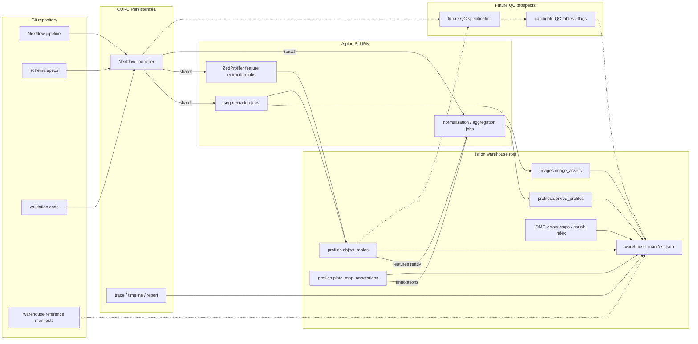

# Future processing plan

This repository defines the NF1 3D organoid image-processing workflow, including segmentation, feature extraction, profile preparation, and warehouse validation.
This plan covers both the **current-data reprocessing exercise** and the **future processing pattern for new data**.
Short term, the work pilots the new workflow and warehouse structure on representative current data before expanding to the current production dataset.
Mid term, the same workflow shape becomes the default for new patients, new plates, and later backfills.
The workflow will write a **bioimage profiling warehouse with a small manifest file** so every image, object, feature table, and patient annotation can be joined by stable identifiers without a bespoke database service.
The manifest is a JSON index that records the active warehouse location, table paths, schemas, source assets, and run provenance.
The design follows the [iceberg-bioimage warehouse specification][iceberg-warehouse], uses [OME-Arrow][ome-arrow] where image payloads or chunk metadata need tabular access, and uses [**ZedProfiler**][zedprofiler] as the feature extractor for morphology profiles.
ZedProfiler's [feature naming convention][zedprofiler-features] is the column standard for profile outputs.
ZedProfiler outputs are written as warehouse profile tables whose `Metadata_*` join keys connect features back to images, masks, and patients.

## Guiding principles

The primary goal is to upgrade this repository around **ZedProfiler** feature extraction while keeping runtime, parallelism, and practical delivery constraints central.
Publication-worthiness is the decision frame: outputs should be reproducible, interpretable, performant, and easy to audit across patients.
The near-term focus is **features and refactoring for parallel execution**, not broad QC policy design.
QC remains future specification work until the project has clearer evidence about which decisions improve reproducibility without masking biology.
Deep-learning features remain in their current bespoke path, while DeepProfiler-style expansion is deprioritized for this project.
The key technical handoff is from **featurization** to **image-based profiling**, including stable identifiers, object-parent links, table shape, and downstream compatibility.
Workflow execution should support chunked, restartable jobs that can create subsets of expected outputs without requiring every file to exist at once.
The workflow plan should prioritize fast ZedProfiler outputs without hiding the complexity of Alpine, Persistence1, scratch storage, and SLURM orchestration.
Ownership boundaries should stay explicit: Dave's deliverable is feature extraction, image-based profiling ownership is a decision point, and orchestration is joint work with Mike and Dave.
Regular working meetings should be used to resolve handoff details, resource behavior, and schema decisions before they become large refactors.

## Target warehouse structure

This section defines where shared outputs live, which tables are required, and which identifiers must be present so images, features, and patient annotations can be joined.
The shared warehouse lives on **Isilon** (also known as Dell PowerScale), a shared network storage used for durable project data, when that storage is available to the compute environment.
For Alpine or other HPC environments without Isilon access, the warehouse can live under the repository's gitignored **`data/`** directory as a local execution target.
The repository tracks workflow code, schema definitions, validation code, configuration, and small reference manifests that point to the active warehouse location.
Each warehouse root contains Parquet-first tables plus **`warehouse_manifest.json`**.
That file lists the warehouse root, table names, table paths or URI prefixes, schema versions, required join keys, source image roots, run IDs, git commit or container metadata, row counts, and validation status.
In practice, collaborator images enter as source assets, including custom TIFF layouts, and are converted to whole-image **OME-Zarr** for canonical image storage.
ZedProfiler features, annotations, derived profiles, and any future QC outputs are not written as OME-Arrow; they are Parquet warehouse tables keyed by `Metadata_*` identifiers.
**OME-Arrow** is reserved for derived crops, chunk indexes, or image tensors that need to be joined and filtered with profiles in DuckDB or other table-oriented analysis tools.
For example, OME-Arrow would fit nucleocentric 3D crops and 2D z-maximum projections when downstream review needs to select cells by object features, treatment metadata, or future single-cell/object QC flags and then load only the matching image crops.
The [OME-Arrow benchmarks][ome-arrow-benchmarks] justify this selective use: reported results include faster bulk image reads and writes for Arrow-backed layouts, a roughly millisecond-scale NF1 feature-to-image join, and faster metadata scans than converted OME-Zarr metadata.

Required namespaces and tables:

The items below are warehouse table namespaces, not fields inside `warehouse_manifest.json`.
The manifest records these tables, their paths, schemas, join keys, source assets, and validation status.

- `images.image_assets`: one row per image asset with `Metadata_Biology_PatientTumor`, `Metadata_Biology_PatientID`, `Metadata_Experiment_PlateID`, `Metadata_Experiment_WellID`, `Metadata_Imaging_FieldID`, `Metadata_Imaging_ImageID`, channel, z/t/c/y/x shape, dtype, source URI, and processing provenance.
- `profiles.organoid_profiles`, `profiles.cell_profiles`, `profiles.nuclei_profiles`, `profiles.cytoplasm_profiles`, and `profiles.nucleocentric_profiles`: one biological object type per table, each keyed by `Metadata_Biology_PatientTumor`, `Metadata_Imaging_ImageID`, `Metadata_Object_ObjectID`, and, when relevant, `Metadata_Object_ParentOrganoidID` or `Metadata_Object_ParentCellID`.
- `profiles.normalized_profiles`, `profiles.selected_profiles`, and `profiles.consensus_profiles`: derived analytical tables that preserve the same stable identifiers and declare their parent tables in the manifest.
- `profiles.plate_map_annotations`: the normalized warehouse form of the plate maps.
  It includes patient, tumor, plate, well, treatment, dose, unit, target, class, and therapeutic category keyed by `Metadata_Biology_PatientTumor`, `Metadata_Experiment_PlateID`, and `Metadata_Experiment_WellID`.

**Column naming is enforced before writing shared outputs.**
Feature columns use **`{Compartment}_{Channel}_{FeatureType}_{Measurement}`**; metadata columns use **`Metadata_{Category}_{Name}`**.
The current `image_set` and `WellFOV` concepts become explicit **`Metadata_Experiment_WellID`** and **`Metadata_Imaging_FieldID`** values, with **`Metadata_Imaging_ImageID`** as the durable join key across image assets, segmentation masks, and profiles.
Plain names such as `dataset_id` and `image_id` remain logical shorthand in implementation discussions, not profile-table column names.
For this dataset, `dataset_id` maps to the plate-level `Metadata_Biology_PatientTumor` value.

## Workflow and observability

### Workflow manager

The workflow layer should keep **SLURM as a first-class execution backend**, because the current shell-plus-SLURM pattern is practical but too hard to audit, restart, and parameterize across patients.
**Nextflow is the target workflow manager for this repository's processing workflow** because its [SLURM executor][nextflow-slurm] submits each process as a separate SLURM job and supports queue controls, local execution, containers, task caching, `-resume`-based workflow continuation, and selective job arrays for homogeneous high-cardinality tasks.
The abstraction layer is **SLURM-compatible HPC execution**, while CURC-specific paths, queues, partitions, modules, containers, and storage locations belong in a named CURC profile.
This is a substantial workflow-engineering change, so the short-term scope is a pilot wrapper around existing stage commands and warehouse publishing rather than a full pipeline rewrite.
After the pilot validates orchestration, outputs, and observability, the same workflow shape can expand to production reprocessing and then become the mid-term default for new data.
**SLURM job arrays** are used selectively for uniform per-well/FOV shards such as segmentation and featurization when resource requirements are consistent.
Tasks with variable memory, GPU, walltime, or container needs remain ordinary SLURM jobs.

### CURC deployment profile

On University of Colorado Research Computing infrastructure, the deployment model runs the **Nextflow controller** on [Persistence1][curc-persistence1], which CURC documents as the place for workflow managers.
The controller does not perform substantial image processing itself.
Instead, it submits each pipeline process to Alpine as an independent SLURM job through `sbatch`, monitors task state, and launches downstream work when dependencies are satisfied.
This gives the pipeline a persistent orchestration layer while allowing 3D segmentation, ZedProfiler feature extraction, [pycytominer][pycytominer] preprocessing, and later QC work to use SLURM scheduling, resource allocation, retries, and fault isolation independently.
Scratch space is used only for ephemeral Nextflow work directories and temporary task files.
Durable workflow outputs, warehouse tables, manifests, reports, and logs are published to Isilon or to the active gitignored `data/` warehouse target before scratch cleanup.

### Run records

Each step writes a small run record next to its outputs: command, git commit, container or environment hash, input table versions, row counts, column counts, elapsed time, and pass/fail status.

### Observability

**Observability combines Nextflow run artifacts with SLURM accounting** rather than requiring a separate monitoring server.
Nextflow emits a trace table, timeline report, DAG, execution report, `.nextflow.log`, and per-process logs under a stable run directory.
The trace table captures process name, patient, well/FOV shard, status, attempt, runtime, CPU, memory, exit code, work directory, and published outputs.
SLURM job IDs are retained so failed or slow tasks can be inspected with `sacct`, `squeue`, `seff`, and the process `.command.out` and `.command.err` files.
A repository-owned DuckDB validation script combines these run artifacts with the warehouse manifest to check manifest conformance, join-key uniqueness, feature-name validity, orphaned profiles, failed tasks, retry counts, and resource outliers.

## ZedProfiler integration

The main implementation work is the **featurization to image-based profiling** handoff.
ZedProfiler replaces the current local handcrafted featurization modules as the production feature extractor for supported object-level 3D morphology profiles.
Its inputs are the registered image assets, segmentation masks, channel metadata, object identifiers, and parent-object relationships produced upstream.
Its supported feature classes are Colocalization, Granularity, Intensity, Neighbors, Texture, and VolumeSizeShape.
Its outputs are per-compartment handcrafted feature tables for nuclei, cells, cytoplasm, and organoids, written with ZedProfiler-compatible feature names and `Metadata_*` identifiers.
Bespoke deep-learning featurization remains in the workflow for masked 3D features across nuclei, cells, cytoplasm, and organoids.
Bespoke deep-learning featurization also remains for nucleocentric non-masked 3D crops from the nuclei mask and nucleocentric non-masked 2D z-maximum projections.
All handcrafted and deep-learning feature outputs publish into `profiles.object_tables`, then flow into existing normalization, feature selection, aggregation, and consensus-profile logic.

## Future QC prospects

QC-related tables are future extensions to the warehouse, not required outputs for the core reprocessing plan.
Future QC work should decide which whole-image and post-featurization object-level checks belong in this project, which fields are stored, and whether any fields gate execution or only annotate records.
Potential coSMicQC integration remains uncharted because the warehouse profile tables would need an explicit input compatibility specification before integration.
That future work should harden the input shape, candidate QC table schemas, and flag semantics before QC is used to filter normalization, feature selection, aggregation, or consensus profiles.

## Implementation sequence

1. **Pilot subset selection:** use `NF0014_T1` and `NF0055_T1`, selecting a few DMSO and treated well/FOVs from each to cover normal images, segmentation edge cases, image-size variation, and object-count variation.
2. **Pilot workflow orchestration:** create a minimal Nextflow SLURM workflow with a CURC profile that wraps the existing stage commands for the pilot subset on Persistence1 and Alpine.
   Use scratch only for temporary work and publish durable Nextflow and SLURM observability artifacts to the active pilot warehouse run-artifacts path on Isilon or the gitignored `data/` fallback.
3. **Pilot warehouse conversion:** publish the pilot workflow outputs to the active pilot warehouse path to finalize identifier rules, canonical table schemas, ZedProfiler feature-name validation, `warehouse_manifest.json`, and DuckDB validation.
4. **Production workflow rollout:** expand the same Nextflow profile and warehouse writer to the production dataset after the pilot passes orchestration, output, validation, and job-array checks.
5. **DuckDB validation view:** use DuckDB to inspect pilot and production warehouse tables for expected joins, row counts, metadata completeness, feature columns, and profile outputs.
6. **Operational validation:** emit run records, Nextflow/SLURM observability artifacts, well/FOV-level profiling status, and a one-command validation report for collaborators, maintainers, and release checkpoints.
The validation report tracks each well/FOV from segmentation through ZedProfiler feature extraction and downstream image-based profiling so late-stage profile errors are visible even when earlier stages succeed.

## Short- and mid-term goals

The **short-term goal** is the reprocessing path for current data.
It starts with the small-data pilot, assesses ZedProfiler output shape, warehouse validation, and workflow observability, then expands to the current production dataset.
The **mid-term goal** is to make this the standard processing pattern for new patients, new plates, and later backfills.
That work decides whether OME-Arrow is needed for image crops or chunk-level access and can incorporate future QC prospects after their specifications are ready.
Patient profile analysis supports both individually processed patient profiles and combined-patient profile tables.
Combined-patient analyses can still concatenate selected profiles for [pycytominer][pycytominer] feature selection, aggregation, and related cytomining workflows.
[pycytominer][pycytominer] operations are expected to be compatible with iceberg-bioimage warehouse tables because the profile outputs remain tabular, metadata-prefixed, and feature-column oriented.
The highest-risk work is not the Parquet writing itself; it is making stable identifiers, patient/well/FOV metadata, and object-parent links consistent across batches before scaling.

## Alternatives considered

- **Current data layout and orchestration:** produces results, but limits cross-patient joins, resumable execution, provenance, and validation.
- **AWS or GCP processing:** remains possible through future Nextflow profiles, but CURC keeps data close to the existing compute environment and avoids premature cloud cost, transfer, credential, and governance complexity.
- **More minimal architecture:** the proposed plan is already the minimum viable structure for this dataset because it includes only stable IDs, a manifest, Parquet tables, Nextflow-on-SLURM execution, and lightweight validation.
- **Simpler data storage:** loose Parquet files, CSVs, and one-off DuckDB files are easy to write, but they do not define stable identifiers, table lineage, required schemas, or image-to-profile joins.
- **CellProfiler:** remains useful for established image QC and feature extraction modules, but it is not the warehouse, scheduler, provenance system, or cross-patient profile query layer.
- **scverse:** might be useful downstream for selected single-cell matrices, but it is not the primary data model for multi-compartment 3D image assets, masks, future QC tables, patient annotations, and parent-object relationships.

## Required specifications

Two small project specifications precede implementation:

- **Identifier spec:** deterministic `Metadata_Biology_PatientTumor`, `Metadata_Imaging_ImageID`, `Metadata_Object_ObjectID`, and parent object rules, including how IDs survive reprocessing.
- **Column schema spec:** required columns, types, nullability, and join keys for each canonical table.
- **Future QC spec:** candidate whole-image and object-level QC fields, optional coSMicQC input shape and output fields, and whether each field gates execution, flags records, or filters downstream profiles.

This plan keeps the current pipeline scientifically intact while making the data FAIRer, easier to audit, and easier to extend to new patients, microscopes, features, and image-backed machine learning analyses.

[iceberg-warehouse]: https://github.com/WayScience/iceberg-bioimage/blob/main/docs/src/warehouse-spec.md
[cosmicqc]: https://github.com/WayScience/cosmicqc
[curc-persistence1]: https://curc.readthedocs.io/en/latest/clusters/alpine/quick-start.html
[nextflow-slurm]: https://docs.seqera.io/nextflow/executor
[ome-arrow]: https://github.com/WayScience/ome-arrow
[ome-arrow-benchmarks]: https://github.com/WayScience/ome-arrow-benchmarks
[pycytominer]: https://github.com/cytomining/pycytominer
[zedprofiler]: https://github.com/WayScience/ZedProfiler
[zedprofiler-features]: https://github.com/WayScience/ZedProfiler/blob/main/docs/src/features/Feature_Naming_Convention.md
