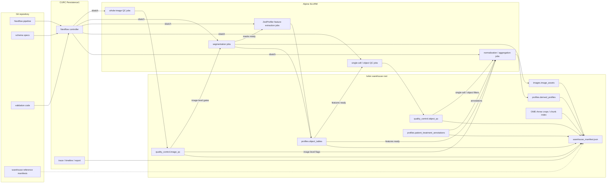

# Future processing plan

This pipeline will become a **manifest-driven bioimage profiling warehouse**: every image, object, whole-image QC result, single-cell/object QC result, feature table, and patient annotation is joinable by stable identifiers, without requiring a bespoke database service.
The design follows the [iceberg-bioimage warehouse specification][iceberg-warehouse], uses [OME-Arrow][ome-arrow] where image payloads or chunk metadata need tabular access, and uses [**ZedProfiler**][zedprofiler] as the feature extractor for morphology profiles.
ZedProfiler's [feature naming convention][zedprofiler-features] is the column standard for profile outputs.

## Target data contract

The shared warehouse lives on **Isilon storage** when that storage is available to the compute environment.
For Alpine or other HPC environments without Isilon access, the warehouse can live under the repository's gitignored **`data/`** directory as a local execution target.
The repository tracks workflow code, schema definitions, validation code, configuration, and small reference manifests that point to the active warehouse location.
Each warehouse root contains Parquet-first tables plus **`warehouse_manifest.json`**.
**OME-TIFF** or **OME-Zarr** remain the source image assets when that is sufficient; **OME-Arrow** is reserved for derived crops, chunk indexes, or image tensors that need to be joined and filtered with profiles in DuckDB.
The [OME-Arrow benchmarks][ome-arrow-benchmarks] justify this selective use: reported results include faster bulk image reads and writes for Arrow-backed layouts, a roughly millisecond-scale NF1 feature-to-image join, and faster metadata scans than converted OME-Zarr metadata.

Required namespaces and tables:

- `images.image_assets`: one row per image asset with `Metadata_Biology_PatientTumor`, `Metadata_Biology_PatientID`, `Metadata_Experiment_PlateID`, `Metadata_Experiment_WellID`, `Metadata_Imaging_FieldID`, `Metadata_Imaging_ImageID`, channel, z/t/c/y/x shape, dtype, source URI, and processing provenance.
- `quality_control.image_qc`: whole-image blur, saturation, corruption, and exclusion flags generated before segmentation and featurization, keyed by `Metadata_Imaging_ImageID`, with patient, well, and field metadata repeated only when useful for reading.
- `quality_control.object_qc`: post-featurization single-cell and object-level QC flags keyed by `Metadata_Biology_PatientTumor`, `Metadata_Imaging_ImageID`, `Metadata_Object_ObjectID`, and object compartment.
- `profiles.organoid_profiles`, `profiles.cell_profiles`, `profiles.nuclei_profiles`, `profiles.cytoplasm_profiles`, and `profiles.nucleocentric_profiles`: one biological object type per table, each keyed by `Metadata_Biology_PatientTumor`, `Metadata_Imaging_ImageID`, `Metadata_Object_ObjectID`, and, when relevant, `Metadata_Object_ParentOrganoidID` or `Metadata_Object_ParentCellID`.
- `profiles.normalized_profiles`, `profiles.selected_profiles`, and `profiles.consensus_profiles`: derived analytical tables that preserve the same stable identifiers and declare their parent tables in the manifest.
- `profiles.patient_treatment_annotations`: patient, tumor, plate map, treatment, dose, unit, target, class, and therapeutic category keyed by patient and well.

**Column naming is enforced before writing shared outputs.**
Feature columns use **`{Compartment}_{Channel}_{FeatureType}_{Measurement}`**; metadata columns use **`Metadata_{Category}_{Name}`**.
The current `image_set` and `WellFOV` concepts become explicit **`Metadata_Experiment_WellID`** and **`Metadata_Imaging_FieldID`** values, with **`Metadata_Imaging_ImageID`** as the durable join key across image assets, segmentation masks, QC, and profiles.
Plain names such as `dataset_id` and `image_id` remain logical shorthand in implementation discussions, not profile-table column names.
For this dataset, `dataset_id` maps to the plate-level `Metadata_Biology_PatientTumor` value.

## Workflow and observability

### Workflow manager

The workflow layer treats **SLURM as a first-class execution backend**, because the current shell-plus-SLURM pattern is practical but too hard to audit, restart, and parameterize across patients.
**Nextflow is the workflow manager for this pipeline** because its [SLURM executor][nextflow-slurm] submits each process as a separate SLURM job and supports queue controls, local execution, containers, task caching, `-resume`-based workflow continuation, and selective job arrays for homogeneous high-cardinality tasks.
**SLURM job arrays** are used selectively for uniform per-well/FOV shards such as whole-image QC, segmentation, and featurization when resource requirements are consistent.
Tasks with variable memory, GPU, walltime, or container needs remain ordinary SLURM jobs.

### CURC deployment

On University of Colorado Research Computing infrastructure, the deployment model runs the **Nextflow controller** on [Persistence1][curc-persistence1], which CURC documents as the place for workflow managers.
The controller does not perform substantial image processing itself.
Instead, it submits each pipeline process to Alpine as an independent SLURM job through `sbatch`, monitors task state, and launches downstream work when dependencies are satisfied.
This gives the pipeline a persistent orchestration layer while allowing whole-image QC, segmentation, ZedProfiler feature extraction, single-cell QC, normalization, and aggregation jobs to use SLURM scheduling, resource allocation, retries, and fault isolation independently.
Scratch space is used only for ephemeral Nextflow work directories and temporary task files.
Durable workflow outputs, warehouse tables, manifests, reports, and logs are published to Isilon or to the active gitignored `data/` warehouse target before scratch cleanup.

### Run records

Each step writes a small run record next to its outputs: command, git commit, container or environment hash, input table versions, row counts, column counts, elapsed time, and pass/fail status.

### Observability

**Observability combines Nextflow run artifacts with SLURM accounting** rather than requiring a separate monitoring server.
Nextflow emits a trace table, timeline report, DAG, execution report, `.nextflow.log`, and per-process logs under a stable run directory.
The trace table captures process name, patient, well/FOV shard, status, attempt, runtime, CPU, memory, exit code, work directory, and published outputs.
SLURM job IDs are retained so failed or slow tasks can be inspected with `sacct`, `squeue`, `seff`, and the process `.command.out` and `.command.err` files.
A single DuckDB validation script combines these run artifacts with the warehouse manifest to check manifest conformance, join-key uniqueness, feature-name validity, orphaned profiles, whole-image exclusion rates, single-cell/object filtering rates, failed tasks, retry counts, and resource outliers.

## ZedProfiler integration

The main implementation work is the **featurization to image-based profiling** handoff.
ZedProfiler replaces the current local handcrafted featurization modules as the production feature extractor for supported object-level 3D morphology profiles.
Its inputs are the registered image assets, segmentation masks, channel metadata, object identifiers, and parent-object relationships produced upstream.
Its supported feature classes are Colocalization, Granularity, Intensity, Neighbors, Texture, and VolumeSizeShape.
Its outputs are per-compartment handcrafted feature tables for nuclei, cells, cytoplasm, and organoids, written with ZedProfiler-compatible feature names and `Metadata_*` identifiers.
Bespoke deep-learning featurization remains in the workflow for masked 3D features across nuclei, cells, cytoplasm, and organoids.
Bespoke deep-learning featurization also remains for nucleocentric non-masked 3D crops from the nuclei mask and nucleocentric non-masked 2D z-maximum projections.
All handcrafted and deep-learning feature outputs publish into `profiles.object_tables`, then flow into existing normalization, feature selection, aggregation, and consensus-profile logic.
Whole-image QC runs before segmentation and featurization so failed image assets can be excluded or flagged before expensive downstream work.
Single-cell and object-level QC runs after ZedProfiler and bespoke deep-learning featurization so feature missingness, object outliers, failed crops, and late-stage profiling errors can be tracked separately from image acquisition failures.
[CytoTable][cytotable] is not the execution engine for this path.
CytoTable remains a compatibility bridge if ZedProfiler outputs need conversion into pycytominer-oriented table shapes or if CellProfiler-style outputs remain in part of the workflow.

## Implementation sequence

1. **Pilot subset selection:** use `NF0014_T1` and `NF0055_T1`, selecting a few DMSO and treated well/FOVs from each to cover normal images, whole-image QC failures, segmentation edge cases, image-size variation, and object-count variation.
2. **Pilot workflow orchestration:** run the pilot subset through the Nextflow `slurm` profile on CURC Persistence1 and Alpine, using scratch only for temporary work and publishing durable Nextflow and SLURM observability artifacts to the active pilot warehouse run-artifacts path on Isilon or the gitignored `data/` fallback.
3. **Pilot warehouse conversion:** publish the pilot workflow outputs to the active pilot warehouse path to finalize identifier rules, canonical table schemas, ZedProfiler feature-name validation, `warehouse_manifest.json`, and DuckDB validation.
4. **Pre-production QC assessment:** review pilot whole-image QC flags before segmentation scale-up, then review post-featurization single-cell/object QC flags, exclusion rates, object counts, failed crops, segmentation failures, and downstream profile failures before expanding to the production dataset.
5. **Production workflow rollout:** apply the same Nextflow profile and warehouse writer to the production dataset after the pilot passes orchestration, output, validation, whole-image QC, single-cell/object QC, and job-array checks.
6. **DuckDB validation view:** use DuckDB to inspect pilot and production warehouse tables for expected joins, row counts, metadata completeness, feature columns, image-level flags, and object-level flags.
7. **Operational validation:** emit run records, Nextflow/SLURM observability artifacts, well/FOV-level profiling status, and a one-command validation report for collaborators, maintainers, and release checkpoints.
The validation report tracks each well/FOV from segmentation through ZedProfiler feature extraction and downstream image-based profiling so late-stage profile errors are visible even when earlier stages succeed.

## Implementation scope

The first milestone runs the small-data pilot through the workflow layer and publishes the resulting outputs to the active pilot warehouse location.
The next milestone assesses whole-image QC before segmentation scale-up and single-cell/object QC after pilot featurization, then sets the initial pass/fail fields used during production rollout.
The following milestone applies the pilot-validated workflow and warehouse writer to the production dataset.
A later milestone backfills prior patients, decides whether OME-Arrow is needed for image crops or chunk-level access, and formalizes the full QC decision policy across image-level and object-level decisions.
Patient profile analysis supports both individually processed patient profiles and combined-patient profile tables.
Combined-patient analyses can still concatenate selected profiles for pycytominer feature selection, aggregation, and related cytomining workflows.
pycytominer-style operations are expected to be compatible with iceberg-bioimage warehouse tables because the profile outputs remain tabular, metadata-prefixed, and feature-column oriented.
The highest-risk work is not the Parquet writing itself; it is making stable identifiers, patient/well/FOV metadata, object-parent links, whole-image QC gates, and post-featurization object QC behavior consistent across batches before scaling.

## Alternatives considered

- **Current data layout and orchestration:** produces results, but limits cross-patient joins, resumable execution, provenance, and validation.
- **AWS or GCP processing:** remains possible through future Nextflow profiles, but CURC keeps data close to the existing compute environment and avoids premature cloud cost, transfer, credential, and governance complexity.
- **More minimal architecture:** the proposed plan is already the minimum viable structure for this dataset because it includes only stable IDs, a manifest, Parquet tables, Nextflow-on-SLURM execution, and lightweight validation.
- **Simpler data storage:** loose Parquet files, CSVs, and one-off DuckDB files are easy to write, but they do not define stable identifiers, table lineage, required schemas, or image-to-profile joins.
- **CellProfiler:** remains useful for established image QC and feature extraction modules, but it is not the warehouse, scheduler, provenance system, or cross-patient profile query layer.
- **CytoTable as execution engine:** remains useful for converting and joining CellProfiler-style tables, but it is not an orchestrator for SLURM jobs, long-running workflow state, retries, run observability, or warehouse-level contracts.
- **scverse:** might be useful downstream for selected single-cell matrices, but it is not the primary data model for multi-compartment 3D image assets, masks, QC tables, patient annotations, and parent-object relationships.

## Required specifications

Two small project specifications precede implementation:

- **Identifier spec:** deterministic `Metadata_Biology_PatientTumor`, `Metadata_Imaging_ImageID`, `Metadata_Object_ObjectID`, and parent object rules, including how IDs survive reprocessing.
- **Column schema spec:** required columns, types, nullability, and join keys for each canonical table.
- **QC stage spec:** required whole-image QC fields before segmentation and required single-cell/object QC fields after featurization, including whether each field gates execution, flags records, or filters downstream profiles.

This plan keeps the current pipeline scientifically intact while making the data FAIRer, easier to audit, and easier to extend to new patients, microscopes, features, and image-backed machine learning analyses.

[iceberg-warehouse]: https://github.com/WayScience/iceberg-bioimage/blob/main/docs/src/warehouse-spec.md
[cytotable]: https://github.com/cytomining/CytoTable
[curc-persistence1]: https://curc.readthedocs.io/en/latest/clusters/alpine/quick-start.html
[nextflow-slurm]: https://docs.seqera.io/nextflow/executor
[ome-arrow]: https://github.com/WayScience/ome-arrow
[ome-arrow-benchmarks]: https://github.com/WayScience/ome-arrow-benchmarks
[zedprofiler]: https://github.com/WayScience/ZedProfiler
[zedprofiler-features]: https://github.com/WayScience/ZedProfiler/blob/main/docs/src/features/Feature_Naming_Convention.md
