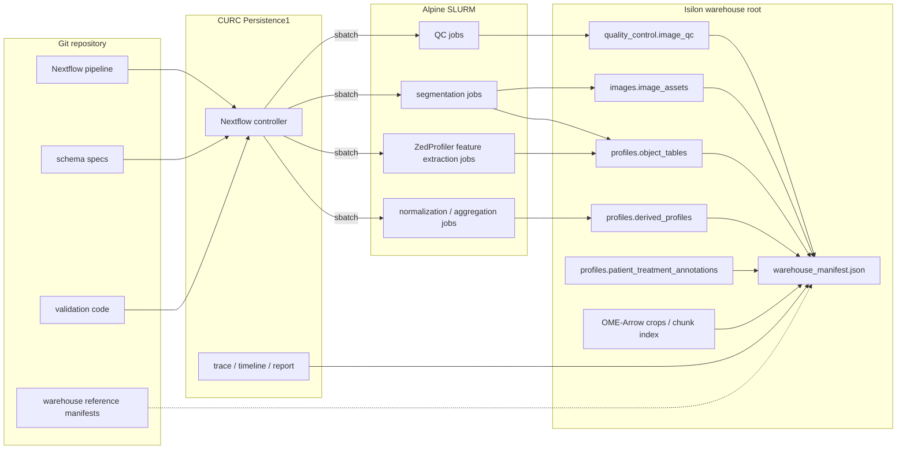

# Future processing plan

This pipeline will become a **manifest-driven bioimage profiling warehouse**: every image, object, QC result, feature table, and patient annotation is joinable by stable identifiers, without requiring a bespoke database service.
The design follows the [iceberg-bioimage warehouse specification][iceberg-warehouse], uses [OME-Arrow][ome-arrow] where image payloads or chunk metadata need tabular access, and uses [**ZedProfiler**][zedprofiler] as the feature extractor for morphology profiles.
ZedProfiler's [feature naming convention][zedprofiler-features] is the column standard for profile outputs.

## Target data contract

The shared warehouse lives on **Isilon storage** when that storage is available to the compute environment.
For Alpine or other HPC environments without Isilon access, the warehouse can live under the repository's gitignored **`data/`** directory as a local execution target.
The repository tracks workflow code, schema definitions, validation code, configuration, and small reference manifests that point to the active warehouse location.
Each warehouse root contains Parquet-first tables plus **`warehouse_manifest.json`**.
**OME-TIFF** or **OME-Zarr** remain the source image assets when that is sufficient; **OME-Arrow** is reserved for derived crops, chunk indexes, or image tensors that need to be joined and filtered with profiles in DuckDB.
The [OME-Arrow benchmarks][ome-arrow-benchmarks] justify this selective use: reported results include faster bulk image reads and writes for Arrow-backed layouts, a roughly millisecond-scale NF1 feature-to-image join, and faster metadata scans than converted OME-Zarr metadata.

Required namespaces and tables:

- `images.image_assets`: one row per image asset with `Metadata_Experiment_DatasetID`, `Metadata_Biology_PatientID`, `Metadata_Experiment_PlateID`, `Metadata_Experiment_WellID`, `Metadata_Imaging_FieldID`, `Metadata_Imaging_ImageID`, channel, z/t/c/y/x shape, dtype, source URI, and processing provenance.
- `quality_control.image_qc`: blur, saturation, corruption, and exclusion flags keyed by `Metadata_Imaging_ImageID`, with patient, well, and field metadata repeated only when useful for reading.
- `profiles.organoid_profiles`, `profiles.cell_profiles`, `profiles.nuclei_profiles`, `profiles.cytoplasm_profiles`, and `profiles.nucleocentric_profiles`: one biological object type per table, each keyed by `Metadata_Experiment_DatasetID`, `Metadata_Imaging_ImageID`, `Metadata_Object_ObjectID`, and, when relevant, `Metadata_Object_ParentOrganoidID` or `Metadata_Object_ParentCellID`.
- `profiles.normalized_profiles`, `profiles.selected_profiles`, and `profiles.consensus_profiles`: derived analytical tables that preserve the same stable identifiers and declare their parent tables in the manifest.
- `profiles.patient_treatment_annotations`: patient, tumor, plate map, treatment, dose, unit, target, class, and therapeutic category keyed by patient and well.

**Column naming is enforced before writing shared outputs.**
Feature columns use **`{Compartment}_{Channel}_{FeatureType}_{Measurement}`**; metadata columns use **`Metadata_{Category}_{Name}`**.
The current `image_set` and `WellFOV` concepts become explicit **`Metadata_Experiment_WellID`** and **`Metadata_Imaging_FieldID`** values, with **`Metadata_Imaging_ImageID`** as the durable join key across image assets, segmentation masks, QC, and profiles.
Plain names such as `dataset_id` and `image_id` remain logical shorthand in implementation discussions, not profile-table column names.

## Workflow and observability

### Workflow manager

The workflow layer treats **SLURM as a first-class execution backend**, because the current shell-plus-SLURM pattern is practical but too hard to audit, resume, and parameterize across patients.
**Nextflow is the workflow manager for this pipeline** because its [SLURM executor][nextflow-slurm] submits each process as a separate SLURM job and supports queue controls, local execution, containers, caching, resumable runs, and selective job arrays for homogeneous high-cardinality tasks.
**SLURM job arrays** are used selectively for uniform per-well/FOV shards such as QC, segmentation, and featurization when resource requirements are consistent.
Tasks with variable memory, GPU, walltime, or container needs remain ordinary SLURM jobs.

### CURC deployment

On University of Colorado Research Computing infrastructure, the deployment model runs the **Nextflow controller** on [Persistence1][curc-persistence1], which CURC documents as the place for workflow managers.
The controller does not perform substantial image processing itself.
Instead, it submits each pipeline process to Alpine as an independent SLURM job through `sbatch`, monitors task state, and launches downstream work when dependencies are satisfied.
This gives the pipeline a persistent orchestration layer while allowing segmentation, ZedProfiler feature extraction, QC, normalization, and aggregation jobs to use SLURM scheduling, resource allocation, retries, and fault isolation independently.

### Run records

Each step writes a small run record next to its outputs: command, git commit, container or environment hash, input table versions, row counts, column counts, elapsed time, and pass/fail status.

### Observability

**Observability combines Nextflow run artifacts with SLURM accounting** rather than requiring a separate monitoring server.
Nextflow emits a trace table, timeline report, DAG, execution report, `.nextflow.log`, and per-process logs under a stable run directory.
The trace table captures process name, patient, well/FOV shard, status, attempt, runtime, CPU, memory, exit code, work directory, and published outputs.
SLURM job IDs are retained so failed or slow tasks can be inspected with `sacct`, `squeue`, `seff`, and the process `.command.out` and `.command.err` files.
A single DuckDB validation script combines these run artifacts with the warehouse manifest to check manifest conformance, join-key uniqueness, feature-name validity, orphaned profiles, QC filtering rates, failed tasks, retry counts, and resource outliers.

## Implementation sequence

1. **Pilot subset selection:** choose one representative patient with a few wells and FOVs that cover normal images, QC failures, segmentation edge cases, and one treatment/control contrast.
2. **Pilot workflow orchestration:** run the pilot subset through the Nextflow `slurm` profile on CURC Persistence1 and Alpine, using the existing stage commands and publishing all Nextflow and SLURM observability artifacts.
3. **Pilot warehouse conversion:** publish the pilot workflow outputs to the active pilot warehouse path to finalize identifier rules, canonical table schemas, ZedProfiler feature-name validation, `warehouse_manifest.json`, and DuckDB validation.
4. **Production workflow rollout:** apply the same Nextflow profile and warehouse writer to the production dataset after the pilot passes orchestration, output, validation, and job-array checks.
5. **Cross-patient queries:** replace ad hoc patient concatenation with manifest-aware DuckDB queries over the production warehouse tables.
6. **Operational validation:** emit run records, Nextflow/SLURM observability artifacts, and a one-command validation report for collaborators, maintainers, and release checkpoints.

## Implementation scope

The first milestone runs the small-data pilot through the workflow layer and publishes the resulting outputs to the active pilot warehouse location.
The next milestone applies the proven workflow and warehouse writer to the production dataset.
A later milestone backfills prior patients, moves cross-patient profile generation onto manifest-aware queries, decides whether OME-Arrow is needed for image crops or chunk-level access, and formalizes QC decision policy.
The highest-risk work is not the Parquet writing itself; it is making stable identifiers, patient/well/FOV metadata, object-parent links, and QC decisions consistent across batches.

## Alternatives considered

- **Current data layout and orchestration:** produces results, but limits cross-patient joins, resumable execution, provenance, and validation.
- **AWS or GCP processing:** remains possible through future Nextflow profiles, but CURC keeps data close to the existing compute environment and avoids premature cloud cost, transfer, credential, and governance complexity.
- **More minimal architecture:** the proposed plan is already the minimum viable structure for this dataset because it includes only stable IDs, a manifest, Parquet tables, Nextflow-on-SLURM execution, and lightweight validation.
- **Simpler data storage:** loose Parquet files, CSVs, and one-off DuckDB files are easy to write, but they do not define stable identifiers, table lineage, required schemas, or image-to-profile joins.
- **CellProfiler:** remains useful for established image QC and feature extraction modules, but it is not the warehouse, scheduler, provenance system, or cross-patient profile query layer.
- **CytoTable as execution engine:** remains useful for converting and joining CellProfiler-style tables, but it is not an orchestrator for SLURM jobs, long-running workflow state, retries, run observability, or warehouse-level contracts.
- **scverse:** might be useful downstream for selected single-cell matrices, but it is not the primary data model for multi-compartment 3D image assets, masks, QC tables, patient annotations, and parent-object relationships.

## Required specifications

Two small project specifications precede implementation:

- **Identifier spec:** deterministic `dataset_id`, `image_id`, `object_id`, and parent object rules, including how IDs survive reprocessing.
- **Column schema spec:** required columns, types, nullability, and join keys for each canonical table.

This plan keeps the current pipeline scientifically intact while making the data FAIRer, easier to audit, and easier to extend to new patients, microscopes, features, and image-backed machine learning analyses.

[iceberg-warehouse]: https://github.com/WayScience/iceberg-bioimage/blob/main/docs/src/warehouse-spec.md
[curc-persistence1]: https://curc.readthedocs.io/en/latest/clusters/alpine/quick-start.html
[nextflow-slurm]: https://docs.seqera.io/nextflow/executor
[ome-arrow]: https://github.com/WayScience/ome-arrow
[ome-arrow-benchmarks]: https://github.com/WayScience/ome-arrow-benchmarks
[zedprofiler]: https://github.com/WayScience/ZedProfiler
[zedprofiler-features]: https://github.com/WayScience/ZedProfiler/blob/main/docs/src/features/Feature_Naming_Convention.md
