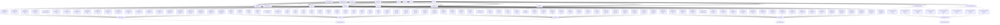
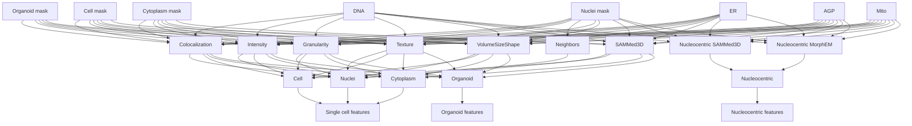

Current

```mermaid
flowchart TD

    %% Channels
    A1[DNA]
    A2[ER]
    A3[AGP]
    A4[Mito]

    %% Masks
    B1[Nuclei mask]
    B2[Cell mask]
    B3[Cytoplasm mask]
    B4[Organoid mask]

    %% Feature categories
    C1[Colocalization]
    C2[Intensity]
    C3[Granularity]
    C4[Neighbors]
    C5[Texture]
    C6[VolumeSizeShape]
    C7[SAMMed3D]
    C8[Nucleocentric SAMMed3D]
    C9[Nucleocentric MorphEM]

    A1 --> C1
    A1 --> C2
    A1 --> C3
    A1 --> C4
    A1 --> C5
    A1 --> C7
    A1 --> C8
    A1 --> C9

    A2 --> C1
    A2 --> C2
    A2 --> C3
    A2 --> C4
    A2 --> C5
    A2 --> C7
    A2 --> C8
    A2 --> C9

    A3 --> C1
    A3 --> C2
    A3 --> C3
    A3 --> C4
    A3 --> C5
    A3 --> C7
    A3 --> C8
    A3 --> C9

    A4 --> C1
    A4 --> C2
    A4 --> C3
    A4 --> C4
    A4 --> C5
    A4 --> C7
    A4 --> C8
    A4 --> C9

    B1 --> C1
    B1 --> C2
    B1 --> C3
    B1 --> C4
    B1 --> C5
    B1 --> C6
    B1 --> C7
    B1 --> C8
    B1 --> C9

    B2 --> C1
    B2 --> C2
    B2 --> C3
    B2 --> C4
    B2 --> C5
    B2 --> C6
    B2 --> C7

    B3 --> C1
    B3 --> C2
    B3 --> C3
    B3 --> C4
    B3 --> C5
    B3 --> C6
    B3 --> C7

    B4 --> C1
    B4 --> C2
    B4 --> C3
    B4 --> C4
    B4 --> C5
    B4 --> C6
    B4 --> C7

    C1 --> D1[Colocalization\nNuclei mask\nAGP DNA]
    C1 --> D2[Colocalization\nNuclei mask\nAGP ER]
    C1 --> D3[Colocalization\nNuclei mask\nAGP Mito]
    C1 --> D4[Colocalization\nNuclei mask\nDNA ER]
    C1 --> D5[Colocalization\nNuclei mask\nDNA Mito]
    C1 --> D6[Colocalization\nNuclei mask\nER Mito]
    C1 --> D7[Colocalization\nCell mask\nAGP DNA]
    C1 --> D8[Colocalization\nCell mask\nAGP ER]
    C1 --> D9[Colocalization\nCell mask\nAGP Mito]
    C1 --> D10[Colocalization\nCell mask\nDNA ER]
    C1 --> D11[Colocalization\nCell mask\nDNA Mito]
    C1 --> D12[Colocalization\nCell mask\nER Mito]
    C1 --> D13[Colocalization\nCytoplasm mask\nAGP DNA]
    C1 --> D14[Colocalization\nCytoplasm mask\nAGP ER]
    C1 --> D15[Colocalization\nCytoplasm mask\nAGP Mito]
    C1 --> D16[Colocalization\nCytoplasm mask\nDNA ER]
    C1 --> D17[Colocalization\nCytoplasm mask\nDNA Mito]
    C1 --> D18[Colocalization\nCytoplasm mask\nER Mito]
    C1 --> D19[Colocalization\nOrganoid mask\nAGP DNA]
    C1 --> D20[Colocalization\nOrganoid mask\nAGP ER]
    C1 --> D21[Colocalization\nOrganoid mask\nAGP Mito]
    C1 --> D22[Colocalization\nOrganoid mask\nDNA ER]
    C1 --> D23[Colocalization\nOrganoid mask\nDNA Mito]
    C1 --> D24[Colocalization\nOrganoid mask\nER Mito]

    C2 --> D25[Intensity\nNuclei mask\nAGP]
    C2 --> D26[Intensity\nNuclei mask\nDNA]
    C2 --> D27[Intensity\nNuclei mask\nER]
    C2 --> D28[Intensity\nNuclei mask\nMito]
    C2 --> D29[Intensity\nCell mask\nAGP]
    C2 --> D30[Intensity\nCell mask\nDNA]
    C2 --> D31[Intensity\nCell mask\nER]
    C2 --> D32[Intensity\nCell mask\nMito]
    C2 --> D33[Intensity\nCytoplasm mask\nAGP]
    C2 --> D34[Intensity\nCytoplasm mask\nDNA]
    C2 --> D35[Intensity\nCytoplasm mask\nER]
    C2 --> D36[Intensity\nCytoplasm mask\nMito]
    C2 --> D37[Intensity\nOrganoid mask\nAGP]
    C2 --> D38[Intensity\nOrganoid mask\nDNA]
    C2 --> D39[Intensity\nOrganoid mask\nER]
    C2 --> D40[Intensity\nOrganoid mask\nMito]

    C3 --> D41[Granularity\nNuclei mask\nAGP]
    C3 --> D42[Granularity\nNuclei mask\nDNA]
    C3 --> D43[Granularity\nNuclei mask\nER]
    C3 --> D44[Granularity\nNuclei mask\nMito]
    C3 --> D45[Granularity\nCell mask\nAGP]
    C3 --> D46[Granularity\nCell mask\nDNA]
    C3 --> D47[Granularity\nCell mask\nER]
    C3 --> D48[Granularity\nCell mask\nMito]
    C3 --> D49[Granularity\nCytoplasm mask\nAGP]
    C3 --> D50[Granularity\nCytoplasm mask\nDNA]
    C3 --> D51[Granularity\nCytoplasm mask\nER]
    C3 --> D52[Granularity\nCytoplasm mask\nMito]
    C3 --> D53[Granularity\nOrganoid mask\nAGP]
    C3 --> D54[Granularity\nOrganoid mask\nDNA]
    C3 --> D55[Granularity\nOrganoid mask\nER]
    C3 --> D56[Granularity\nOrganoid mask\nMito]

    C4 --> D57[Neighbors\nNuclei mask]

    C5 --> D58[Texture\nNuclei mask\nAGP]
    C5 --> D59[Texture\nNuclei mask\nDNA]
    C5 --> D60[Texture\nNuclei mask\nER]
    C5 --> D61[Texture\nNuclei mask\nMito]
    C5 --> D62[Texture\nCell mask\nAGP]
    C5 --> D63[Texture\nCell mask\nDNA]
    C5 --> D64[Texture\nCell mask\nER]
    C5 --> D65[Texture\nCell mask\nMito]
    C5 --> D66[Texture\nCytoplasm mask\nAGP]
    C5 --> D67[Texture\nCytoplasm mask\nDNA]
    C5 --> D68[Texture\nCytoplasm mask\nER]
    C5 --> D69[Texture\nCytoplasm mask\nMito]
    C5 --> D70[Texture\nOrganoid mask\nAGP]
    C5 --> D71[Texture\nOrganoid mask\nDNA]
    C5 --> D72[Texture\nOrganoid mask\nER]
    C5 --> D73[Texture\nOrganoid mask\nMito]

    C6 --> D74[VolumeSizeShape\nNuclei mask]
    C6 --> D75[VolumeSizeShape\nCell mask]
    C6 --> D76[VolumeSizeShape\nCytoplasm mask]
    C6 --> D77[VolumeSizeShape\nOrganoid mask]

    C7 --> D78[SAMMed3D\nNuclei mask\nAGP]
    C7 --> D79[SAMMed3D\nNuclei mask\nDNA]
    C7 --> D80[SAMMed3D\nNuclei mask\nER]
    C7 --> D81[SAMMed3D\nNuclei mask\nMito]
    C7 --> D82[SAMMed3D\nCell mask\nAGP]
    C7 --> D83[SAMMed3D\nCell mask\nDNA]
    C7 --> D84[SAMMed3D\nCell mask\nER]
    C7 --> D85[SAMMed3D\nCell mask\nMito]
    C7 --> D86[SAMMed3D\nCytoplasm mask\nAGP]
    C7 --> D87[SAMMed3D\nCytoplasm mask\nDNA]
    C7 --> D88[SAMMed3D\nCytoplasm mask\nER]
    C7 --> D89[SAMMed3D\nCytoplasm mask\nMito]
    C7 --> D90[SAMMed3D\nOrganoid mask\nAGP]
    C7 --> D91[SAMMed3D\nOrganoid mask\nDNA]
    C7 --> D92[SAMMed3D\nOrganoid mask\nER]
    C7 --> D93[SAMMed3D\nOrganoid mask\nMito]

    C8 --> D94[Nucleocentric SAMMed3D\nNuclei mask\nAGP]
    C8 --> D95[Nucleocentric SAMMed3D\nNuclei mask\nDNA]
    C8 --> D96[Nucleocentric SAMMed3D\nNuclei mask\nER]
    C8 --> D97[Nucleocentric SAMMed3D\nNuclei mask\nMito]

    C9 --> D98[Nucleocentric MorphEM\nNuclei mask\nAGP]
    C9 --> D99[Nucleocentric MorphEM\nNuclei mask\nDNA]
    C9 --> D100[Nucleocentric MorphEM\nNuclei mask\nER]
    C9 --> D101[Nucleocentric MorphEM\nNuclei mask\nMito]


    %% Colocalization origins
    D1 --> E1[Nuclei Table]
    D2 --> E1[Nuclei Table]
    D3 --> E1[Nuclei Table]
    D4 --> E1[Nuclei Table]
    D5 --> E1[Nuclei Table]
    D6 --> E1[Nuclei Table]
    D7 --> E2[Cell Table]
    D8 --> E2[Cell Table]
    D9 --> E2[Cell Table]
    D10 --> E2[Cell Table]
    D11 --> E2[Cell Table]
    D12 --> E2[Cell Table]
    D13 --> E3[Cytoplasm Table]
    D14 --> E3[Cytoplasm Table]
    D15 --> E3[Cytoplasm Table]
    D16 --> E3[Cytoplasm Table]
    D17 --> E3[Cytoplasm Table]
    D18 --> E3[Cytoplasm Table]
    D19 --> E4[Organoid Table]
    D20 --> E4[Organoid Table]
    D21 --> E4[Organoid Table]
    D22 --> E4[Organoid Table]
    D23 --> E4[Organoid Table]
    D24 --> E4[Organoid Table]
    D25 --> E1[Nuclei Table]
    D26 --> E1[Nuclei Table]
    D27 --> E1[Nuclei Table]
    D28 --> E1[Nuclei Table]
    D29 --> E2[Cell Table]
    D30 --> E2[Cell Table]
    D31 --> E2[Cell Table]
    D32 --> E2[Cell Table]
    D33 --> E3[Cytoplasm Table]
    D34 --> E3[Cytoplasm Table]
    D35 --> E3[Cytoplasm Table]
    D36 --> E3[Cytoplasm Table]
    D37 --> E4[Organoid Table]
    D38 --> E4[Organoid Table]
    D39 --> E4[Organoid Table]
    D40 --> E4[Organoid Table]
    D41 --> E1[Nuclei Table]
    D42 --> E1[Nuclei Table]
    D43 --> E1[Nuclei Table]
    D44 --> E1[Nuclei Table]
    D45 --> E2[Cell Table]
    D46 --> E2[Cell Table]
    D47 --> E2[Cell Table]
    D48 --> E2[Cell Table]
    D49 --> E3[Cytoplasm Table]
    D50 --> E3[Cytoplasm Table]
    D51 --> E3[Cytoplasm Table]
    D52 --> E3[Cytoplasm Table]
    D53 --> E4[Organoid Table]
    D54 --> E4[Organoid Table]
    D55 --> E4[Organoid Table]
    D56 --> E4[Organoid Table]
    D57 --> E1[Nuclei Table]
    D58 --> E1[Nuclei Table]
    D59 --> E1[Nuclei Table]
    D60 --> E1[Nuclei Table]
    D61 --> E1[Nuclei Table]
    D62 --> E2[Cell Table]
    D63 --> E2[Cell Table]
    D64 --> E2[Cell Table]
    D65 --> E2[Cell Table]
    D66 --> E2[Cell Table]
    D67 --> E3[Cytoplasm Table]
    D68 --> E3[Cytoplasm Table]
    D69 --> E3[Cytoplasm Table]
    D70 --> E4[Organoid Table]
    D71 --> E4[Organoid Table]
    D72 --> E4[Organoid Table]
    D73 --> E4[Organoid Table]
    D74 --> E1[Nuclei Table]
    D75 --> E2[Cell Table]
    D76 --> E3[Cytoplasm Table]
    D77 --> E4[Organoid Table]
    D78 --> E1[Nuclei Table]
    D79 --> E1[Nuclei Table]
    D80 --> E1[Nuclei Table]
    D81 --> E1[Nuclei Table]
    D82 --> E2[Cell Table]
    D83 --> E2[Cell Table]
    D84 --> E2[Cell Table]
    D85 --> E2[Cell Table]
    D86 --> E3[Cytoplasm Table]
    D87 --> E3[Cytoplasm Table]
    D88 --> E3[Cytoplasm Table]
    D89 --> E3[Cytoplasm Table]
    D90 --> E4[Organoid Table]
    D91 --> E4[Organoid Table]
    D92 --> E4[Organoid Table]
    D93 --> E4[Organoid Table]
    D94 --> E5[Nucleocentric Table]
    D95 --> E5[Nucleocentric Table]
    D96 --> E5[Nucleocentric Table]
    D97 --> E5[Nucleocentric Table]
    D98 --> E5[Nucleocentric Table]
    D99 --> E5[Nucleocentric Table]
    D100 --> E5[Nucleocentric Table]
    D101 --> E5[Nucleocentric Table]

    E1 --> F1[Single cell features]
    E2 --> F1[Single cell features]
    E3 --> F1[Single cell features]
    E4 --> F2[Organoid features]
    E5 --> F3[Nucleocentric features]
```

Proposed:

```mermaid
graph TD

    A1[DNA]
    A2[ER]
    A3[AGP]
    A4[Mito]

    %% Masks
    B1[Nuclei mask]
    B2[Cell mask]
    B3[Cytoplasm mask]
    B4[Organoid mask]

    %% Feature categories
    C1[Colocalization]
    C2[Intensity]
    C3[Granularity]
    C4[Neighbors]
    C5[Texture]
    C6[VolumeSizeShape]
    C7[SAMMed3D]
    C8[Nucleocentric SAMMed3D]
    C9[Nucleocentric MorphEM]

    A1 --> C1
    A1 --> C2
    A1 --> C3
    %% A1 --> C4
    A1 --> C5
    A1 --> C6
    A1 --> C7
    A1 --> C8
    A1 --> C9
    A2 --> C1
    A2 --> C2
    A2 --> C3
    %% A2 --> C4
    A2 --> C5
    A2 --> C6
    A2 --> C7
    A2 --> C8
    A2 --> C9
    A3 --> C1
    A3 --> C2
    A3 --> C3
    %% A3 --> C4
    A3 --> C5
    A3 --> C6
    A3 --> C7
    A3 --> C8
    A3 --> C9
    A4 --> C1
    A4 --> C2
    A4 --> C3
    %% A4 --> C4
    A4 --> C5
    A4 --> C6
    A4 --> C7
    A4 --> C8
    A4 --> C9

    B1 --> C1
    B1 --> C2
    B1 --> C3
    B1 --> C4
    B1 --> C5
    B1 --> C6
    B1 --> C7
    B1 --> C8
    B1 --> C9

    B2 --> C1
    B2 --> C2
    B2 --> C3
    %% B2 --> C4
    B2 --> C5
    B2 --> C6
    B2 --> C7
    %% B2 --> C8
    %% B2 --> C9

    B3 --> C1
    B3 --> C2
    B3 --> C3
    %% B3 --> C4
    B3 --> C5
    B3 --> C6
    B3 --> C7

    B4 --> C1
    B4 --> C2
    B4 --> C3
    %% B4 --> C4
    B4 --> C5
    B4 --> C6

    C1 --> D1[Nuclei]
    C1 --> D2[Cell]
    C1 --> D3[Cytoplasm]
    C1 --> D4[Organoid]
    C2 --> D1
    C2 --> D2
    C2 --> D3
    C2 --> D4
    C3 --> D1
    C3 --> D2
    C3 --> D3
    C3 --> D4
    C4 --> D1
    C5 --> D1
    C5 --> D2
    C5 --> D3
    C5 --> D4
    C6 --> D1
    C6 --> D2
    C6 --> D3
    C6 --> D4
    C7 --> D1
    C7 --> D2
    C7 --> D3
    C7 --> D4
    C8 --> D5[Nucleocentric]
    C9 --> D5[Nucleocentric]

    D1 --> E1[Single cell features]
    D2 --> E1[Single cell features]
    D3 --> E1[Single cell features]
    D4 --> E4[Organoid features]
    D5 --> E5[Nucleocentric features]
```
